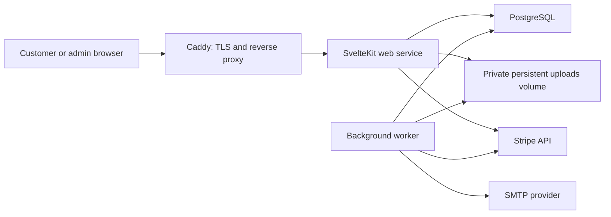

# Bookstore Full-Stack Application Design

**Date:** 2026-08-08

**Status:** Approved conversational design; awaiting review of this written specification

## 1. Purpose

Transform the existing SvelteKit bookstore prototype into a production-capable web application for selling and reading the owner's prose books and comics. The application will run through Docker Compose on a single Hetzner VPS, use PostgreSQL as its system of record, retain uploaded originals on local persistent storage, and preserve clean extension points for S3 and Redis without requiring either initially.

The work begins with a complete, strict TypeScript migration. Backend implementation starts only after that migration passes its quality gates.

## 2. Product goals

- Preserve the existing visual prototype while replacing browser-only and in-memory behavior with durable server-side functionality.
- Support prose supplied as EPUB and comics supplied as CBZ or ZIP image archives.
- Retain every accepted revision's uploaded original for entitled customer downloads.
- Sell each title as a one-time purchase and provide configurable free previews.
- Support email/password accounts, password reset, magic-link sign-in, guest checkout, and later claiming of guest purchases.
- Give administrators safe tools for catalog management, immutable file revisions, private review, publication, rollback, auditing, and sales reporting.
- Deploy reproducibly to a Hetzner VPS with Docker Compose, Caddy, production secrets, backups, health checks, and operational documentation.

## 3. Initial non-goals

- Third-party social authentication
- Subscriptions, bundles, discount campaigns, or marketplace sellers
- Browser-based editing of EPUB or comic contents
- Automatic rewriting or regeneration of uploaded books
- S3-backed production storage in the first release
- Redis or a separate queue service without a demonstrated need
- Multi-region deployment or zero-downtime guarantees on the initial single VPS
- A custom accounting system or tax engine
- An in-application refund interface; initial refunds can be initiated in Stripe and synchronized back through webhooks

Taxes collected by Stripe are recorded separately and excluded from sales revenue. This specification provides operational sales reporting, not formal accounting or tax advice.

## 4. Current-state assessment

The repository is a SvelteKit frontend prototype with JavaScript source, large interactive reader and studio components, local-storage-backed identity/library state, and in-memory or prototype service integrations. The frontend is a useful behavioral and visual baseline, but its current persistence and authorization mechanisms are not suitable for production.

The migration will retain SvelteKit as the full-stack framework instead of introducing a second API application. This reduces deployment and type-sharing complexity while the product is owned and operated as a single application.

## 5. Chosen architecture

### 5.1 Modular SvelteKit monolith

The application will use SvelteKit with `adapter-node`. Server functionality will be divided into narrow modules with explicit interfaces:

- `auth`: Better Auth integration, sessions, identity verification, and roles
- `db`: PostgreSQL connection, Drizzle schema, transactions, and migrations
- `storage`: provider-neutral original and derived-asset storage
- `ingestion`: EPUB and CBZ/ZIP validation, parsing, sanitization, and derivation
- `catalog`: titles, metadata, revisions, previews, and publication state
- `commerce`: Stripe checkout, orders, payments, refunds, and entitlements
- `email`: provider-neutral SMTP delivery and templates
- `jobs`: PostgreSQL-backed jobs and transactional outbox processing
- `audit`: append-only administrative and system event recording
- `reporting`: sales aggregation, Stripe fee reconciliation, and payout estimates

Routes and SvelteKit actions will call these modules rather than embedding persistence or vendor logic in UI files. Browser code will never import server modules.

### 5.2 Runtime topology

The web and worker services use the same immutable application image with different entry points. Caddy is the only publicly exposed container. PostgreSQL and the upload volume remain private to the Compose network.

### 5.3 PostgreSQL-backed background work

Jobs and email outbox records live in PostgreSQL. Workers claim jobs transactionally, use bounded retry with exponential backoff, and move exhausted work to a failed state for admin review. This covers book ingestion, transactional email, and Stripe reconciliation without adding Redis.

Redis can be introduced later behind the job or caching interfaces if measured workload or multi-instance coordination makes it necessary.

## 6. Environment and deployment design

### 6.1 Development

Development uses Docker Compose for PostgreSQL and Mailpit, plus a web and worker process with source mounts. Local non-production configuration and secrets are loaded from a developer-owned `.env` file that is excluded from version control. Uploaded fixtures and development originals use a local persistent volume.

### 6.2 Production

The Hetzner VPS runs a production Compose stack containing:

- Caddy
- SvelteKit web service
- Background worker
- PostgreSQL
- Named volumes for PostgreSQL data and uploaded assets

Production uses immutable versioned images, health checks, restart policies, resource limits, and pinned service versions. Database migrations run as an explicit, one-shot deployment step before the new application containers start.

Sensitive values originate in the invoking deployment process environment and are declared as Compose secrets. Containers receive them as files under `/run/secrets`; no production `.env` is copied to or stored on the VPS. Non-sensitive settings remain ordinary environment variables. Application configuration code supports both environment values and secret-file values with startup validation.

The future CI/CD pipeline can provide the same process environment and run the documented migration and Compose deployment commands without changing application configuration conventions.

## 7. TypeScript migration: Implementation Plan 0

The first implementation plan is a behavior-preserving, strict TypeScript migration of the existing prototype.

It will:

- Convert all JavaScript modules to TypeScript.
- Convert every Svelte component script to `lang="ts"`.
- Type component props, events, stores, route data, service boundaries, and reader state.
- Introduce explicit domain types for titles, revisions, library entries, reading progress, checkout state, and authentication state.
- Break up oversized files only where needed to create typeable, testable boundaries; unrelated visual refactors are excluded.
- Remove JavaScript compatibility from the final source configuration.
- Avoid blanket `any`, broad type assertions, and unexplained suppression directives.
- Preserve the prototype's current behavior and presentation.

Plan 0 is complete only when TypeScript checking, Svelte checking, linting, tests, and the production build pass with no migration-related errors.

## 8. Data model

All primary keys are UUIDs. Timestamps are stored in UTC. Email addresses are trimmed and normalized to lowercase for identity matching. Monetary values are stored in integer minor units with an ISO currency code; different currencies are never implicitly combined.

Drizzle schema definitions are the source of truth. Generated SQL migrations are committed and reviewed. Database constraints enforce important invariants in addition to application validation.

### 8.1 Identity and authorization

Better Auth owns its required user, credential, session, account, and verification records. Application role records distinguish `customer` and `admin`. The first administrator is created through an explicit container CLI command. Later role changes require an existing administrator and create audit events.

### 8.2 Catalog

`titles` contains stable, mutable product information:

- Slug, title, subtitle, description, creator information, and cover reference
- Format classification: prose or comic
- Price in minor units and currency
- Storefront visibility: `private`, `public`, or `archived`
- Current active revision reference
- Creation and update timestamps

Title visibility and revision readiness are independent. A private title can have a complete active revision and can be reviewed by administrators without appearing publicly.

### 8.3 Immutable revisions and assets

`title_revisions` represents immutable content editions. Each revision records:

- Title and optional parent revision
- Retained original asset reference for accepted revisions, plus checksum, MIME type, byte size, and original filename
- Creator and change summary
- Lifecycle state: `uploaded`, `processing`, `ready_for_review`, `failed`, `active`, or `retired`
- Validation or processing failure details visible only to administrators
- Creation, processing, activation, and retirement timestamps

Processed prose sections, comic pages, navigation data, and derived images belong to one revision. They are regenerated only from that revision's retained original.

Preview boundaries are revision-specific because chapter and page structures can change between uploads. EPUB previews use validated section/location boundaries; comic previews use validated page boundaries. An administrator must confirm or adjust preview boundaries for a candidate revision before publication.

Only one revision is active for a title. Previous revisions and originals remain retained for audit and rollback. Application workflows never mutate or silently replace a revision's source file.

### 8.4 Commerce and entitlement

Commerce records include:

- `orders` and `order_items` with immutable title, price, tax, currency, and customer-email snapshots
- `payments`, `refunds`, and idempotently processed `stripe_events`
- `entitlements` granting a user access to a title
- Stripe balance transactions, payouts, reconciliation state, and per-item fee allocations

Unique constraints cover Stripe event, checkout session, payment, charge, refund, balance transaction, and payout identifiers as applicable.

An entitlement points to the stable title rather than a purchased revision. Entitled customers receive the title's currently active revision, including corrected replacements and deliberate rollbacks.

### 8.5 Reader state

Server-side reader data includes reading progress, stable content anchors, bookmarks, and reader preferences. Progress anchors include revision context so a replacement revision cannot silently map a reader to an invalid position. The reader will attempt a safe location migration and otherwise fall back to the beginning with a clear message.

### 8.6 Operations

Operational tables include jobs, transactional email outbox records, append-only audit events, and reconciliation exceptions. Audit records contain timestamp, actor type and identifier, action, outcome, resource, redacted before/after details, and a request or job correlation identifier.

## 9. Authentication and email flows

### 9.1 Customer authentication

The first release supports:

- Email/password registration and sign-in
- Password reset through a short-lived, single-use email token
- Magic-link sign-in through a short-lived, single-use token
- Secure, HTTP-only, same-site session cookies
- Sign-out and session invalidation

Third-party OAuth is excluded.

### 9.2 Guest checkout and claiming

A guest can purchase with an email address without creating a password first. The fulfilled order remains associated with the normalized purchase email.

To claim a guest purchase, the customer must prove control of that address through a magic link. After verification, a transaction attaches all eligible unclaimed purchases for that normalized email to the authenticated user and creates missing entitlements idempotently. Existing entitlements are not duplicated.

### 9.3 SMTP abstraction

Application email uses a provider-neutral SMTP adapter. Mailpit captures development messages. Production receives SMTP host, port, credentials, sender, and security settings through runtime configuration and Docker secrets.

Email is enqueued transactionally with the state change that requires it, then delivered by the worker. A transient SMTP failure cannot roll back a completed order or user action.

## 10. Storage and ingestion

### 10.1 Storage interface

The storage interface provides operations for writing, reading, statting, and deleting explicitly identified objects, plus protected streaming. The initial local implementation uses generated object keys beneath a private persistent volume.

An S3 adapter stub implements the same interface contract but fails startup with a clear unsupported-provider error if selected before implementation. No code outside the storage module depends on local filesystem paths.

### 10.2 Upload pipeline

Only administrators can upload source material. Uploads stream into a private staging location and never load a whole book into web-process memory.

The pipeline performs:

- Compressed-size and expanded-size limit enforcement
- Extension, MIME, file-signature, and archive-structure checks
- Checksum calculation
- Path traversal, absolute path, symlink, and ZIP-bomb protection
- EPUB container and navigation validation
- EPUB HTML and CSS sanitization, with scripts and unsafe external resources removed
- CBZ/ZIP image validation and deterministic natural page ordering
- Derived content and image generation
- Transactional promotion from staging to retained revision storage

The original EPUB or CBZ/ZIP is retained unchanged. Derived reader assets can be regenerated and are never treated as the canonical download.

### 10.3 Failure behavior

Failed ingestion marks only the candidate revision as failed and records safe diagnostics. It never alters the active revision or public title. Failed revision records remain for audit, but rejected or unsafe staging bytes are not customer-downloadable and are cleaned by an idempotent maintenance job after a retention window. Successfully validated originals are promoted to retained revision storage and are not removed by staging cleanup.

## 11. Revision review and publication

### 11.1 New titles

1. A new title starts with `private` visibility.
2. An administrator uploads an original, creating an immutable candidate revision.
3. The worker validates and processes the revision.
4. A successful candidate becomes `ready_for_review`.
5. The administrator previews the full reader, retained-original download, metadata, and preview boundaries through authenticated admin routes.
6. The administrator selects a reviewed revision as active while the title remains private.
7. A distinct **Publish to storefront** action changes visibility to `public` and exposes the configured free preview.

Background processing never changes title visibility.

### 11.2 Correcting a public title

Uploading a replacement never changes the live edition. The existing active revision remains available while the private candidate is processed and reviewed.

After review, the administrator uses an explicit **Publish replacement** action. In one database transaction, the action retires the old active revision, activates the candidate revision, and records the audit event. Reader content and original downloads therefore switch together. If processing fails or the administrator abandons the candidate, the live edition remains untouched.

For a public title, the application does not offer a generic activation action that could accidentally expose a candidate. Only the deliberately labeled and confirmed **Publish replacement** action can change its active revision.

### 11.3 Withdrawal and rollback

Changing a title from public to private removes it and its free preview from the public storefront but preserves files, revisions, orders, and entitlements. Existing entitled customers retain library access.

Rollback is an explicit audited action selecting a previously valid revision. For a public title, the active revision changes atomically without an availability gap.

## 12. Catalog, preview, reader, and download access

Public catalog and preview routes require `public` title visibility. Knowing a private title's URL or identifier does not grant access.

Free preview endpoints expose only the active revision's configured preview range. Full reader and original-download endpoints authorize every request against an entitlement or admin role. Caddy never serves the upload volume directly, and responses never reveal storage paths.

Original downloads use the active revision's retained source with safe content-disposition headers. This ensures that the browser reader and downloadable edition remain consistent after publication, correction, or rollback.

## 13. Purchase and fulfillment

1. The server creates an order draft using current title and price data.
2. The server creates a Stripe Checkout Session with internal identifiers stored in Stripe metadata.
3. The browser redirects to Stripe.
4. A signed Stripe webhook is received and recorded idempotently.
5. Only a verified successful payment webhook can mark an order paid and grant entitlements.
6. A transactional outbox record schedules confirmation email and financial reconciliation.
7. Browser success redirects display the server's current order state but never grant access themselves.

Stripe webhook signature verification uses the raw request body. Duplicate, delayed, and out-of-order events are safe. Order snapshots remain historically accurate if a title's price or metadata changes later.

## 14. Admin dashboard

Every dashboard route and action performs server-side admin authorization. Hiding controls in the browser is never considered access control.

### 14.1 Catalog operations

Administrators can:

- Create and edit title metadata and price
- Upload and inspect immutable revisions
- Review ingestion errors
- Configure revision-specific preview boundaries
- Preview private or candidate material
- Publish, withdraw, replace, and roll back material
- Inspect relevant jobs and retry failed safe operations

### 14.2 Audit trail

The audit trail is append-only and viewable only by administrators. It records:

- Metadata, price, preview, and visibility changes
- Revision uploads, processing outcomes, activation, replacement, and rollback
- Admin role changes and sensitive account actions
- Stripe webhook, reconciliation, and worker actions that alter durable state
- Timestamp, actor, action, outcome, affected resource, redacted before/after values, and correlation identifier

Audit entries cannot be edited or deleted through the application. Sensitive values, credentials, session tokens, magic-link tokens, and complete payment data are never logged. Viewing detailed audit entries is itself audited.

The dashboard supports pagination and filtering by date, actor, action, resource type, and outcome.

### 14.3 Sales and payout reporting

The sales dashboard reports, for every book or comic:

- Copies sold, refunded copies, and net copies
- Gross sales excluding collected tax
- Refund and dispute amounts
- Allocated Stripe processing and dispute fees
- Estimated payout revenue
- Currency and reconciliation status
- Filters for date range, title, format, and currency

Copies sold count successfully paid order items. Net copies subtract fully refunded items; partial refunds change monetary totals but do not count as a returned copy unless the refund is explicitly attributed to the complete item. The default reporting date is the order's paid timestamp, while payout details retain their separate settlement dates.

Estimated payout revenue is defined as:

`gross sales - refunds - Stripe processing fees - dispute adjustments`

Stripe balance transactions are the financial reconciliation source. A background job imports the immutable charge, refund, fee, dispute, and adjustment records linked to application payments. For orders containing multiple titles, payment-level fees are allocated proportionally by item subtotal with deterministic minor-unit rounding.

Single-item and full-order refunds can be attributed deterministically. A partial refund of a multi-title order that Stripe cannot identify at item level enters the `exception` state until an administrator allocates it to order items. The allocation and any later correction are audited.

Each financial record has one of these reporting states:

- `pending`: Stripe financial detail is not yet available
- `fee_reconciled`: Stripe balance transactions and actual fees have been captured
- `payout_reconciled`: transactions are associated with a completed automatic payout
- `exception`: records do not reconcile and require administrator review

Automatic Stripe payouts can be associated with their included balance transactions after Stripe reports reconciliation completion. Manual or instant payouts can remain fee-reconciled without claiming an exact payout assignment. The UI labels the figure as an estimate until payout reconciliation completes. Totals remain separated by currency.

## 15. Security design

- Better Auth manages password hashing, verification tokens, and sessions.
- Secure cookies and origin/CSRF protections cover state-changing browser requests.
- Authorization is enforced in server modules and endpoints.
- Login, password reset, magic link, guest claim, checkout, download, and sensitive admin actions use configurable PostgreSQL-backed rate limits.
- Upload size and archive-expansion limits are configurable and enforced during streaming and processing.
- All database access uses parameterized queries through Drizzle.
- Stripe webhooks are signature-verified and idempotent.
- Protected asset requests authorize before opening storage streams.
- Logs and audit records redact secrets and sensitive payment or identity data.
- Production containers run with the minimum practical privileges and do not expose PostgreSQL or upload storage publicly.

## 16. Error handling and observability

Domain modules return typed application errors that map to stable HTTP responses. Users receive actionable but non-sensitive messages. Logs use structured records with request, job, order, and revision correlation identifiers.

The worker retries transient failures with bounded exponential backoff. Permanent validation failures do not retry indefinitely. Exhausted jobs and reconciliation mismatches appear in the admin dashboard for investigation and controlled retry.

Health endpoints distinguish process liveness from dependency readiness. Initial monitoring covers:

- Web and worker health
- Database connectivity
- Queue age and failed-job counts
- Email outbox backlog
- Stripe reconciliation exceptions
- Disk and upload-volume capacity
- Backup success and age

## 17. Backup and recovery

PostgreSQL data and retained uploads form one recoverable system and must be backed up on a coordinated schedule. Backups are encrypted and copied off the VPS. At least one retention tier protects against discovering corruption or accidental changes after the most recent backup.

Deployment documentation includes:

- Database backup and upload-volume snapshot commands
- Off-host transfer and retention procedure
- Full restore into an isolated environment
- Post-restore integrity checks for database rows, checksums, and protected downloads
- A periodic restore drill

Application-level destructive actions favor reversible state changes. Revisions and audit events are not silently purged.

## 18. Testing strategy

### 18.1 Unit tests

Unit tests cover domain policies, authorization decisions, publication state transitions, preview boundaries, money allocation, storage contracts, archive validation, and error mapping.

### 18.2 Integration tests

Integration tests use real PostgreSQL and temporary local storage. They cover migrations, Better Auth integration, transactions, job claiming, outbox delivery, entitlements, audit append behavior, Stripe idempotency, balance-transaction reconciliation, and storage isolation.

Mail tests use Mailpit in development integration runs. Stripe tests use signed webhook fixtures and mocked official API responses at the adapter boundary.

### 18.3 Ingestion fixtures

Committed test fixtures cover:

- Valid EPUB, CBZ, and ZIP comic inputs
- Malformed containers and navigation
- Unsafe paths and symlinks
- Excessive compression expansion
- Invalid or unsupported images
- EPUB scripts and external resources
- Replacement revisions with changed chapter and page structures

### 18.4 End-to-end tests

Playwright tests cover:

- Registration, email/password sign-in, sign-out, reset, and magic links
- Guest checkout and later claim
- Paid checkout fulfillment from webhook to entitlement
- Public catalog and free preview access
- Protected reader and original downloads
- New-title private review and storefront publication
- Replacement upload, review, explicit publication, and rollback
- Admin-only audit and sales dashboards
- Unauthorized access attempts

### 18.5 Deployment verification

The production image receives a smoke test before release. Deployment verification checks migrations, health endpoints, authentication, protected storage, worker execution, and a non-destructive Stripe/email configuration check.

## 19. Decomposed implementation plans

This program is too large for one safe implementation plan. The approved delivery order is:

### Plan 0: Strict TypeScript migration

Convert and type the prototype without changing its product behavior. Establish type, check, lint, test, and build gates.

### Plan 1: Test foundation, environments, and configuration

Add the test harness, development and production Compose definitions, adapter-node build, validated environment/secret loading, PostgreSQL, Mailpit, Caddy baseline, and shared application configuration.

### Plan 2: Database, domain foundation, jobs, and audit

Add Drizzle schemas and migrations, transaction conventions, catalog/revision skeletons, PostgreSQL job and outbox infrastructure, append-only audit service, and foundational admin authorization policies.

### Plan 3: Authentication, email, guest identity, and admin access

Integrate Better Auth, password reset, magic links, SMTP delivery, guest identity records, first-admin CLI tooling, role management, and protected dashboard shell.

### Plan 4: Storage, ingestion, revisions, and publication

Implement local storage, the S3 stub, secure EPUB/CBZ ingestion, retained originals, derived content, revision review, preview boundaries, explicit publication/replacement, withdrawal, rollback, and corresponding audit views.

### Plan 5: Catalog, previews, reader, library, and downloads

Connect the existing storefront and reader to server data, implement public previews, entitlement-protected reading and downloads, library state, progress, bookmarks, and safe revision transitions.

### Plan 6: Stripe commerce, claims, and financial reporting

Implement checkout, signed idempotent webhooks, orders, payment fulfillment, entitlements, guest purchase claiming, refunds/dispute synchronization, balance-transaction and payout reconciliation, fee allocation, and the sales dashboard.

### Plan 7: Production hardening and Hetzner operations

Complete container hardening, rate limits, structured logging, health and capacity monitoring, backup/restore automation and documentation, production smoke tests, deployment runbook, and the interface expected by a future GitHub Actions pipeline.

Each plan must keep the application runnable, preserve completed behavior, and pass its relevant automated checks before the following plan begins. A detailed execution plan will be written for each phase only when that phase is ready to start.

## 20. Acceptance criteria for the completed program

The program is complete when:

- The repository contains no production JavaScript source that escaped the strict TypeScript migration.
- A customer can register, authenticate, reset a password, use a magic link, purchase as a guest or account holder, claim a guest purchase, and access entitled material.
- EPUB and CBZ/ZIP originals can be safely uploaded, processed, reviewed privately, published explicitly, downloaded by entitled customers, replaced without accidental publication, and rolled back.
- Public users can see only public catalog data and configured preview boundaries.
- Administrators can manage catalog metadata and publication, inspect append-only audit history, and view per-title sales, fees, and payout estimates.
- Stripe events are verified and idempotent, and financial records expose reconciliation exceptions rather than hiding them.
- PostgreSQL and uploaded assets survive container replacement and have a tested off-host recovery path.
- The development stack uses Mailpit and a local `.env`; production uses process-sourced Docker secrets and no production `.env` file.
- The application deploys through the documented Hetzner Docker Compose runbook and passes production smoke checks.

## 21. Authoritative integration references

- [SvelteKit adapter-node](https://svelte.dev/docs/kit/adapter-node)
- [Better Auth SvelteKit integration](https://better-auth.com/docs/integrations/svelte-kit)
- [Better Auth magic links](https://better-auth.com/docs/plugins/magic-link)
- [Drizzle PostgreSQL setup](https://orm.drizzle.team/docs/get-started/postgresql-new)
- [Drizzle migrations](https://orm.drizzle.team/docs/migrations)
- [Docker Compose secrets](https://docs.docker.com/reference/compose-file/secrets/)
- [Docker secret usage](https://docs.docker.com/compose/how-tos/use-secrets/)
- [Stripe reporting and reconciliation](https://docs.stripe.com/plan-integration/get-started/reporting-reconciliation)
- [Stripe payout reconciliation](https://docs.stripe.com/payouts/reconciliation)
