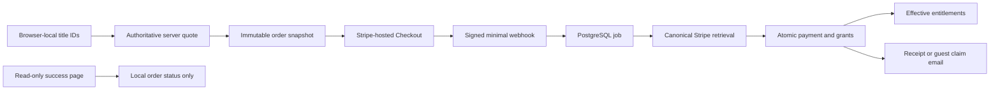

# Plan 6A: Stripe Commerce, Guest Claims, and Entitlement Lifecycle Design

**Date:** 2026-08-10

**Status:** Approved

**Depends on:** Plans 1-5 and `2026-08-08-bookstore-full-stack-design.md`

## 1. Purpose

Plan 6A adds the first legitimate acquisition path to the bookstore. It replaces the removed prototype checkout with server-owned multi-title orders, Stripe-hosted Checkout, signature-verified asynchronous fulfillment, paid entitlement grants, guest purchase claiming, and refund/dispute-driven access changes.

The original Plan 6 scope has been split into two independently verifiable plans:

- Plan 6A owns checkout, payments, claims, refunds, disputes, and the entitlement lifecycle.
- Plan 6B will own Stripe balance transactions, processing fees, payouts, deterministic financial allocation, reconciliation exceptions, and the administrator sales dashboard.

Production remains in maintenance mode through Plan 6A. Commerce is not considered launch-ready until Plan 6B and the remaining production gates are complete.

## 2. Goals

Plan 6A will provide:

- A versioned multi-title cart with one digital copy per title.
- Authoritative server quoting and immutable order snapshots.
- Stripe-hosted Checkout using dashboard-managed eligible payment methods.
- Optional Stripe Tax with tax-exclusive storefront pricing and tax calculated at checkout.
- Signed, idempotent, minimally persisted Stripe webhook ingestion.
- PostgreSQL-backed asynchronous payment fulfillment.
- Immediate account entitlements after verified payment.
- Guest purchase identities and one-use email claiming through Better Auth.
- Durable entitlement grants that explain why a user owns a title.
- Refund allocation sufficient to make unambiguous access decisions.
- Dispute suspension, restoration, and revocation behavior.
- Transactional customer email and append-only audit events.
- Automated coverage for duplicate, delayed, and out-of-order Stripe events.

## 3. Non-goals

Plan 6A does not implement:

- Stripe balance-transaction imports, processing-fee reconciliation, payout association, or estimated payout revenue.
- The administrator sales, fee, payout, or reconciliation-exception dashboard.
- An application refund or dispute-response interface. Those actions remain in Stripe Dashboard.
- Subscriptions, bundles, adjustable quantities, discount campaigns, promotion codes, gift purchases, or marketplace sellers.
- Persistent server-side carts, abandoned-cart campaigns, cross-device cart synchronization, or inventory reservations.
- Saved payment methods, an application-managed Stripe Customer catalog, invoices, or a customer billing portal.
- A custom card form, Stripe Elements, or storage of payment-method details.
- Free full-title acquisition. Zero-price titles are not purchasable in this plan; free previews remain available.
- Mixed-currency orders or automatic splitting into multiple Stripe Sessions.
- Direct reader or original-download access for an unclaimed guest purchase.
- Full accounting, tax-registration decisions, or legal advice.
- Redis, a new queue service, or a new runtime dependency unless the implementation-time dependency review proves one is necessary.
- Opening the production storefront.

## 4. Chosen architecture

### 4.1 Modules and ownership

Plan 6A extends the modular SvelteKit monolith with focused commerce modules:

- `commerce/cart` owns the browser cart contract and version migration. It has no pricing or authorization authority.
- `commerce/quote` loads current public titles, prices, formats, currencies, active-edition availability, and account ownership.
- `commerce/orders` validates a submitted quote and creates immutable order and item snapshots.
- `commerce/stripe` is a narrow provider adapter around Checkout Sessions, PaymentIntents, Refunds, and Disputes. Routes, jobs, and UI code do not depend directly on Stripe SDK object shapes.
- `commerce/webhooks` verifies Stripe signatures, minimizes accepted event data, deduplicates events, and enqueues jobs.
- `commerce/fulfillment` retrieves canonical Stripe state and applies monotonic order, payment, grant, email, and audit transitions.
- `commerce/refunds` imports canonical refund state and creates only deterministic allocations.
- `commerce/disputes` maps the Stripe dispute lifecycle to purchase-grant suspension, restoration, or revocation.
- `commerce/grants` projects durable grants into the existing effective `entitlements` rows consumed by Plan 5.
- `commerce/claims` attaches every eligible purchase for a verified normalized email to one user.
- `commerce/email` defines versioned purchase, claim, refund-access, and dispute-access messages over the existing outbox.

SvelteKit routes remain thin adapters. Stripe network calls do not occur inside database transactions. Every cross-system action has a durable local record and an idempotency key that permits safe retry.

### 4.2 End-to-end flow

The browser redirect never grants access. Only processing that originates from a signature-verified Stripe event may turn a purchase into a fulfilled payment.

### 4.3 Plan 6B seam

Plan 6A records stable Stripe payment, charge, refund, dispute, order-item, amount, currency, and lifecycle identifiers. Plan 6B will consume those records without changing checkout or entitlement semantics. Plan 6A does not enqueue unhandled Plan 6B jobs; new paid/refund/dispute records instead begin with an explicit financial reconciliation state that Plan 6B can scan and advance.

## 5. Cart and quote model

### 5.1 Browser cart

The cart is versioned browser state containing only unique title UUIDs and a client-generated checkout-attempt UUID. Presentation data is never trusted from storage. A migration function discards malformed, unsupported-version, duplicate, or oversized state rather than guessing.

The storefront adds:

- An accessible cart count in the shared header.
- Add, remove, and view-cart controls on catalog and title pages.
- A dedicated `/cart` page with current covers, title metadata, price, currency, ownership, and availability.
- Clear empty, changed, unavailable, mixed-currency, already-owned, ready-to-claim, reserved, pending, and retry states.

The cart permits at most 25 distinct titles and fixes quantity at one. This application limit is intentionally smaller than Stripe Checkout's provider maximum.

### 5.2 Authoritative quote

The cart page sends only bounded title UUIDs to a same-origin quote endpoint. The server returns a quote with a stable fingerprint over the ordered title IDs, current price snapshots, currency, and availability-relevant version data.

A purchasable title must:

- Be public.
- Have a current active revision and published presentation.
- Have a positive price.
- Use the same currency as every other cart item.
- Not already have an active entitlement, paid same-email guest purchase ready to claim, suspended purchase grant, or unresolved purchase hold for the signed-in user.

The server reports disjoint `alreadyOwnedTitleIds`, `claimableTitleIds`, `reservedTitleIds`, and unavailable entries without disclosing private-title data. Ownership has precedence over claimable, which has precedence over reserved, so every requested ID appears in exactly one quote partition. A cart containing only rejected entries cannot begin Checkout. Ready-to-claim items link to `/claim` without putting an email in the URL.

### 5.3 Changed quotes

Checkout submission includes the most recently displayed quote fingerprint. The server reloads and locks the relevant title and entitlement rows. If title membership, availability, ownership, price, or currency differs, it returns `CART_CHANGED` with a new safe quote and creates neither an order nor a Stripe Session. The customer must explicitly confirm the revised cart.

This rule prevents silent price increases, purchases of newly unavailable material, and duplicate account purchases.

### 5.4 Signed-account duplicate-purchase holds

For a signed-in user/title, an unresolved order in `checkout_pending`, `checkout_open`, `payment_pending`, `failed`, or `exception` is a purchase hold. The same rule covers a matching paid but unclaimed guest purchase and direct-user or same-email guest purchase grants suspended by an open dispute. These holds prevent a second one-time charge; they are not finite-inventory reservations. Anonymous cross-device deduplication remains out of scope before fulfillment establishes a canonical paid email.

Only a signature-verified, canonically reduced Checkout Session `expired` state releases a hold. Wall-clock age cannot prove that an earlier Session was not created or paid while its webhook was delayed, so `checkout_pending` never releases solely because a local deadline passed. Paid ownership supersedes the hold. An ambiguous hold requires provider-verified operational recovery in Plan 7, never a manual database state edit.

The current attempt is excluded from its own quote only while a pending/open order remains safely resumable within the shared 30-second provider-call window. At the boundary or afterward, the old attempt conflicts and the quote reports the title reserved. A changed or partially rejected cart cannot mutate the immutable accepted item set; it must rotate to a fresh attempt after the old hold is resolved.

## 6. Commerce data model

All money uses integer minor units and uppercase ISO currency codes. Different currencies are never summed. Stripe IDs are opaque bounded strings and are never parsed for authorization.

### 6.1 Orders

`orders` records:

- Lifecycle state: `checkout_pending`, `checkout_open`, `payment_pending`, `paid`, `expired`, `failed`, or `exception`.
- Optional initiating user for an authenticated checkout.
- Optional guest identity after guest payment.
- Normalized purchase-email snapshot, fixed from the verified account at account-order creation or from canonical Checkout state at guest payment.
- One currency and immutable subtotal.
- Nullable tax and total until canonical Checkout values are available.
- Unique client checkout-attempt ID.
- Unique nullable Stripe Checkout Session ID.
- A one-way digest of a pseudorandom, attempt-scoped order-status credential.
- Checkout expiration, payment, creation, and update timestamps.

A paid account order must retain its initiating user and original verified account email. A paid guest order must retain a normalized canonical Checkout email and guest identity. An order can never be both purchase types.

### 6.2 Order items

`order_items` records one row per distinct title with:

- Stable title ID.
- Immutable title, creator, format, and currency snapshots.
- Unit subtotal, tax, and total minor amounts.
- Optional Stripe line-item identifier after canonical retrieval.

Quantity is structurally one. Item snapshots never change when catalog metadata or pricing later changes. Tax and total may transition once from unknown to canonical Checkout values; afterward they are immutable.

### 6.3 Payments

`payments` records one canonical PaymentIntent per order with:

- Normalized state: `pending`, `succeeded`, or `failed`.
- Unique Stripe PaymentIntent ID and nullable unique latest-charge ID.
- Amount, currency, paid timestamp, and safe payment-method category when available.
- Financial reconciliation state reserved for Plan 6B.

Payment-method details, fingerprints, card brands and last four digits, billing addresses, receipt URLs, and complete Stripe responses are not persisted.

### 6.4 Refunds and allocations

`refunds` records unique Stripe Refund IDs, payment association, normalized provider state, amount, currency, safe reason, provider timestamps, and future financial reconciliation state.

`refund_allocations` records a nonnegative amount from one succeeded refund to one order item and whether it was allocated automatically or administratively. Constraints and locked service validation ensure:

- Allocations for a refund never exceed that refund's succeeded amount.
- Cumulative allocations to an item never exceed its paid total.
- Failed or canceled refunds contribute no active allocation.

Plan 6A automatically allocates only a single-title refund or a full-order refund. Partial multi-title refunds enter `exception` without changing item access until Plan 6B supplies an audited administrative allocation.

### 6.5 Disputes

`disputes` records unique Stripe Dispute IDs, payment association, amount, currency, safe reason, normalized state `open | won | lost`, provider timestamps, and future reconciliation state.

The table does not store evidence, customer narratives, card data, billing data, or complete provider payloads.

### 6.6 Entitlement grants

`entitlement_grants` explains each independent source of title access. It records:

- Title and optional user.
- Source type `purchase` or `preserved`.
- Unique nullable order-item source for purchase grants.
- Grant state `unclaimed`, `active`, `suspended`, or `revoked`.
- State reason and lifecycle timestamps.

An unclaimed paid guest purchase has no user and cannot authorize reader or download access. Claiming sets its user and activates it if payment, refund, and dispute state permit. A paid account purchase begins active.

The projection rule is exact: an effective `entitlements` row is active when at least one active grant exists for the user and title. If no active grant exists, the row is revoked. Re-activation clears `revokedAt`. Projection locks the user/title scope so concurrent payment, claim, refund, or dispute jobs cannot overwrite one another.

After an operation-local Stripe-event or identity row is locked, every purchase-graph mutation uses the same order: order, payment, refunds, refund allocations, disputes, order items, sorted user/title entitlement scopes, then purchase grants. Canonical provider lookup happens before the transaction; an unlocked payment lookup may identify the order, but the service re-reads and validates payment evidence only after locking the order. This order also matches preserved-grant projection and prevents claim, refund, dispute, and preserved-access transactions from deadlocking one another.

The migration creates `preserved` grants for every active Plan 5 entitlement. This prevents the commerce migration from revoking development, test, or legitimate pre-commerce access. Revoked entitlement rows remain revoked and receive no active preserved grant.

### 6.7 Stripe events

`stripe_events` records only:

- Unique event ID.
- Allowlisted event type and object ID.
- Stripe creation time, API version, and live/test mode.
- SHA-256 digest of the verified raw body.
- Processing state and received/processed timestamps.

Complete event payloads are not retained. A database transaction inserts the event and its deduplicated job together. If either write fails, neither remains and Stripe can retry delivery.

### 6.8 Outbox idempotency

The existing outbox gains an optional stable deduplication key. Commerce uses it to ensure that a retried fulfillment or claim-email job cannot create multiple logical purchase messages. SMTP remains at least once, so the same logical message can still be delivered twice after a process crash; every email remains safe to receive twice.

### 6.9 Application rate limits

An application-owned rate-limit table stores a hashed scope key, fixed-window boundary, count, and expiration. Commerce uses namespaced keys for quote and Checkout creation without reading or mutating Better Auth's vendor-owned rate-limit rows. Atomic upserts prevent concurrent requests from bypassing a limit, and each ordinary namespaced consumption performs a bounded, idempotent cleanup of expired rows.

## 7. Checkout Session creation

### 7.1 Durable order before provider call

After a successful locked re-quote, one transaction creates the order, item snapshots, status-token hash, and audit event. The transaction commits before Stripe is called.

Stripe Session creation uses:

- `mode=payment`.
- Inline `price_data` derived exclusively from order-item snapshots.
- Quantity one and no adjustable quantity.
- Lowercase order currency.
- Format-specific configured Stripe tax codes.
- Tax behavior `exclusive`.
- `automatic_tax.enabled` from explicit configuration.
- Adaptive pricing explicitly disabled so the accepted order currency and amount remain authoritative.
- Dashboard-managed eligible payment methods rather than a hard-coded method list.
- Internal order UUID and schema version in metadata and `client_reference_id`.
- The order UUID as the Stripe API idempotency key.
- A deterministic whole-second expiration based on the accepted order time: the configured 30-minute window plus at most one minute of provider-creation allowance.
- The application's success and cancel URLs.

Metadata never contains email, names, tokens, roles, storage identifiers, or complete title metadata.

### 7.2 Account and guest identity

For a signed-in checkout, the order is permanently bound to the authenticated user and snapshots the verified account email. That address receives the application receipt. It may prefill Checkout, but a Checkout contact-email change cannot rewrite the purchase identity, redirect the entitlement, or redirect application email to another user.

For a guest checkout, Stripe collects the email. The app does not create a guest identity from unverified browser input. Only a canonically paid Checkout Session supplies the normalized email snapshot used to create or find the guest identity.

Plan 6A does not maintain reusable Stripe Customer records. Stripe may represent the payer as a guest customer according to Checkout's current behavior.

### 7.3 Retry and recovery

On successful Session creation, the app stores the unique Session ID, expiration, and `checkout_open` state. The URL remains only in the immediate server response used for browser navigation and is never persisted. The browser receives a redirect, not secret provider data.

If the network response is lost, the same local checkout attempt retries the same order, deterministic expiration, and Stripe idempotency key only inside the shared 30-second outbound-call safety window. Once that window closes, orchestration conflicts instead of calling Stripe again, while the title remains reserved until signed canonical terminal evidence arrives. If Stripe created the Session but the local update failed, metadata and the later verified webhook can still attach the Session to the existing order. A delayed exact attachment is accepted only while the order is `checkout_pending` or `checkout_open`; payment-pending, paid, failed, expired, and exception states conflict rather than returning a stale hosted URL. An already-expired provider response is retained as a fulfillable reserved association but never returned as a usable redirect. A conflicting Session ID places the order in `exception`.

An unchanged open order may return its existing unexpired Checkout URL. A changed cart creates a new order after explicit quote confirmation. Abandoned or canceled browser navigation does not grant access.

### 7.4 Price-hold policy

The Session is a short-lived accepted quote with a 30-minute configured hold and no more than one additional minute reserved for safe provider creation. If an administrator changes a title's price or visibility after Session creation, a valid payment completed before Session expiration is honored at the stored order price. Entitlements point to stable titles and therefore follow the existing active-edition behavior.

This rule avoids charging a customer and then withholding the purchased title because of a concurrent catalog edit. Administrators can expire an exceptional open Session in Stripe Dashboard if a legal or operational emergency requires it.

## 8. Success, cancellation, and order status

Before redirect, the app derives a domain-separated HMAC credential from the application secret and the random checkout-attempt UUID, stores only its one-way digest, and sends the plaintext value in an HTTP-only cookie. The credential is stable for exact concurrent retries, so reversed response order cannot overwrite a valid cookie with an obsolete one. The cookie is Secure in production, SameSite Lax, path-scoped where practical, bounded in lifetime, and unrelated to authentication sessions.

The success URL identifies the order but does not include a claim token, email, or payment credential. Status access requires either:

- The authenticated user who initiated the order; or
- The matching order-status cookie for a guest attempt.

The status endpoint returns a minimal view:

- `pending`: payment or webhook processing has not completed, including a signed asynchronous failure that can still be superseded by later canonical success.
- `paid`: account customer may open the library.
- `paid_guest`: purchase succeeded and the customer should check email to claim it.
- `expired`: the signed terminal state that releases the purchase hold and permits a fresh attempt.
- `exception`: safe support guidance without provider details; the purchase hold remains.

The success page polls with a bounded interval and stops on a true terminal state, navigation, or timeout. A locally normalized asynchronous `failed` state is deliberately nonterminal: the browser continues polling, preserves the checkout attempt and cart, and warns against another checkout because a later canonical success remains valid. It cannot retrieve Stripe state or invoke fulfillment. Losing a guest status cookie reveals no email and does not prevent receipt or claim through email.

Canceling returns to the intact cart. The cart removes paid title IDs only after the browser observes canonical paid status or later sees those titles as actively owned.

## 9. Webhook receiver

### 9.1 Verification and minimization

`POST /api/webhooks/stripe` reads the untouched bounded request body and uses the configured webhook signing secret and tolerance. It rejects missing or invalid signatures with `400` before parsing or writing application data.

The receiver also requires event live/test mode to match explicit application configuration. This prevents a valid test event from mutating a live deployment or a live event from mutating a test deployment.

The Stripe Dashboard endpoint uses API version `2026-07-29.dahlia`. Valid unsupported events return `200` without durable application work. The exact Plan 6A allowlist is:

- `checkout.session.completed`
- `checkout.session.async_payment_succeeded`
- `checkout.session.async_payment_failed`
- `checkout.session.expired`
- `refund.created`
- `refund.updated`
- `refund.failed`
- `charge.dispute.created`
- `charge.dispute.updated`
- `charge.dispute.closed`
- `charge.dispute.funds_withdrawn`
- `charge.dispute.funds_reinstated`

Plan 6B will extend the allowlist for balance-transaction and payout reconciliation.

### 9.2 Idempotent acceptance

For a supported event, the receiver extracts only the event and object identifiers after signature verification. One transaction inserts the minimized event and a job deduplicated by event ID.

A duplicate event returns `200` and does not enqueue a second job. The receiver performs no Stripe retrieval, payment transition, entitlement change, or email delivery before acknowledging the event.

## 10. Canonical payment fulfillment

### 10.1 Provider retrieval

The worker maps the event family to its provider adapter and retrieves the current canonical Checkout Session, complete paginated line items, PaymentIntent, Refund, or Dispute. Event order is not treated as state order.

Before a payment can succeed locally, fulfillment verifies:

- Live/test mode.
- Order ID and metadata schema version.
- Session and PaymentIntent linkage.
- Session payment status.
- Exact order currency.
- Exact title/order-item membership and quantity one.
- Exact subtotal, per-item tax, per-item total, order tax, and order total.
- A normalized guest email when no initiating user exists.

Missing, conflicting, or over-limit data transitions the order or provider record to `exception`, emits a redacted system audit event, and grants nothing. The failure remains inspectable through existing failed-job and audit tools.

### 10.2 Delayed payment methods

A completed Session whose canonical payment status is unpaid moves to `payment_pending` and grants nothing. A later asynchronous success event can advance it to paid. An asynchronous failure can move an unpaid order to failed, but failed remains reserved because a later canonical success is supported. A later signed Session-expired reduction may move failed to the sole releasing `expired` state. Once expired, every later paid/pending/failed/exception mutation is rejected; a succeeded payment never regresses because an older event arrives later.

### 10.3 Atomic paid transition

With the order locked, one transaction:

1. Upserts the canonical succeeded payment.
2. Finalizes order and item tax/total snapshots.
3. Marks the order paid once.
4. Creates one purchase grant per order item.
5. Activates account grants or leaves guest grants unclaimed.
6. Reprojects affected effective entitlements.
7. Enqueues the appropriate receipt or guest-claim email work.
8. Appends a minimized system audit event.
9. Marks the Stripe event processed.

If any write fails, the whole transition rolls back and the job retries. Concurrent duplicate jobs serialize on the order and provider identifiers and observe the already-applied state.

## 11. Guest receipt and claim flow

### 11.1 Combined purchase and claim message

After guest fulfillment, a deduplicated commerce email job first checks whether the normalized paid email belongs to an account with a password credential. With no credential, it asks Better Auth to issue a one-use magic link with:

- The normalized paid-order email.
- A same-origin claim completion callback.
- Strict commerce metadata identifying the safe versioned email template and order summary source.

The installed Better Auth plugin passes metadata to its mail callback. The callback uses a commerce receipt-and-claim template instead of the generic sign-in template and enqueues it with a stable outbox deduplication key. The message contains safe order snapshots and a **Claim your purchases** action. At link consumption, the server locks and rechecks account state. If a credential appeared after issuance, the link cannot mint commerce authorization; a magic-derived authorization is likewise rejected if a credential exists when claiming.

If any matching password account exists, verified or unverified, the flow sends the safe receipt and an exact-purpose Better Auth password-reset message rather than a claim magic link. The reset token is the email proof. Better Auth changes the password and revokes all sessions before the application consumes the bound commerce-reset marker, marks that exact account verified, and mints a reset-derived one-use claim authorization cookie. The reset page then signs in explicitly with the new password and links to `/claim/complete`; no follow-up verification email is sent. Ordinary verification does not auto-sign in, stale ordinary verification markers are invalidated by commerce recovery, and ordinary verification/reset/magic callbacks cannot mint commerce authorization. In-session change-password is disabled so an in-flight old session cannot overwrite recovery; late old-password sign-in is revalidated against the current credential hash. A mismatch or guard fault scrubs the valid cookie before fallible exact-session cleanup, clears the pending Better Auth session, and returns only the ordinary generic invalid-credentials response. Magic generation checks use the same cleanup invariant and additionally clear redirect state.

Project-owned `credential_authority` is the durable credential-generation boundary and lives outside generated Better Auth schema. Migration backfills every exact legacy credential hash and fails on duplicate/null legacy credentials; tests execute the real migration SQL and prove invalid legacy shapes roll back. First-admin bootstrap establishes authority atomically, while ordinary registration's separate post-create transaction must finish before signup returns and leaves any partial credential sign-in fail-closed/reset-recoverable. Password and credential-bound magic sessions require the live account hash to equal the authorized hash. Every magic action has a hashed one-use marker bound to that generation, so post-reset and in-flight stale links delete their newly created session and expire its cookie. If Better Auth strips an intervening unverified credential after mailbox proof, the link may remove orphan authority and proceed passwordless only with no reset epoch or an exact live unapplied epoch marker; an applied/missing/expired/malformed/ambiguous reset marker rejects because the applied reset is newer mailbox-proven authority. Any surviving authority routes a new claim request to password recovery. A verified intervening credential also remains and rejects. Every successful magic action invalidates pending reset tokens and clears its reset epoch/passwordless authority under the user lock. Reset issuance promotes only its exact live Better Auth token, rotates a per-user epoch while leaving the current authorized password usable, and invalidates sibling native tokens. Each reset marker records a digest of the exact hash it applied; completion must match it, and stale rollback restores prior authority only by compare-and-swap. Missing/mismatched state fails closed and is recovered only by a fresh mailbox reset, never by blessing the live hash.

Expired links can be re-requested from a generic claim page. Responses never reveal whether an email has an account, guest identity, paid order, or unclaimed purchase.

### 11.2 Claim transaction

The claim completion route requires a current Better Auth session with a verified normalized email and the narrowly scoped HttpOnly commerce-authorization cookie. It then locks:

- The matching guest identity.
- All paid purchase grants for that identity/email.
- Their order items.
- Every affected user/title entitlement projection scope.

The transaction rechecks whether the account has a credential, requires reset-derived authority when it does, and consumes the email-bound authorization in the same transaction as the claim. It sets the guest identity's claimant once, associates all eligible grants with the authenticated user, derives each grant's active/suspended/revoked state from current payment, refund, and dispute data, reprojects entitlements, and appends one audit event with aggregate counts rather than order contents. A rollback preserves the one-use authorization for a safe retry; a committed authorization cannot be replayed.

Repeated claims by the same user are idempotent. A guest identity already claimed by a different user is an exception and reveals no purchase detail. Because application users have unique normalized emails, ordinary legitimate claims converge on one user.

### 11.3 Access boundary

An unclaimed guest grant never authorizes a library, reader, media, or original-download request. The receipt links to claiming, not directly to protected files. After a successful claim, the existing Plan 5 access policy works without a guest-specific bypass.

## 12. Refund behavior

### 12.1 Canonical refund import

Refund event jobs retrieve the current Refund and associated canonical payment. The worker upserts state idempotently and ignores failed or canceled amounts when computing financial or access effects.

Automatic allocation is deliberately narrow:

- Every succeeded refund on a single-title order allocates to that item.
- A succeeded refund equal to the complete remaining refundable order amount allocates each item to its remaining paid total.
- A partial refund on a multi-title order receives no guessed allocation and enters `exception` for Plan 6B.

Multiple succeeded refunds can accumulate. A purchase grant becomes permanently revoked only when succeeded allocations equal the complete paid total for that order item.

### 12.2 Effective access

After allocation changes, the worker locks affected grants and user/title projections. Refunding one purchase cannot revoke access provided by another active purchase or preserved grant.

The app sends a customer email only when effective access changes. Stripe's own refund receipt settings remain independent.

## 13. Dispute behavior

Dispute jobs retrieve the current Dispute and related payment rather than deriving a final outcome from the triggering event name.

- `open`: suspend every purchase grant funded by the disputed payment.
- `won` or funds reinstated: restore each otherwise-valid grant.
- `lost`: permanently revoke the affected payment's grants.

Projection after each transition preserves access from another active grant. A customer message is enqueued only when effective title access changes. Audit records contain order/payment resource IDs, normalized state, and aggregate affected-title count, not evidence or customer narratives.

Dispute evidence and responses remain Stripe Dashboard operations.

## 14. Error handling and observability

### 14.1 Customer-facing errors

Stable commerce results include:

- `INVALID_CART`: malformed, empty, duplicate, oversized, or mixed-currency input.
- `CART_CHANGED`: server quote no longer matches the reviewed quote.
- `NOT_PURCHASABLE`: no safe purchasable entries remain.
- `CHECKOUT_UNAVAILABLE`: Stripe is disabled, unavailable, or temporarily failed.
- `ORDER_NOT_FOUND`: missing or unauthorized status access.
- `ORDER_PENDING`: canonical fulfillment is not complete.

Responses do not reveal private titles, other users' ownership, guest identities, Stripe request details, or whether a claim email maps to purchases.

### 14.2 Retry classification

Network failures, Stripe rate limiting, provider `5xx` responses, and transient database errors remain retryable. Invalid canonical shapes, amount mismatches, identity conflicts, impossible state regressions, and unsupported provider states are permanent exceptions requiring review.

Checkout API idempotency and job deduplication cover ambiguous network outcomes. The implementation never retries by creating a different provider object for the same local attempt.

### 14.3 Structured diagnostics

Logs use correlation, order, job, and safe Stripe object IDs. They never include secrets, signatures, raw webhook bodies, emails, addresses, claim links, Checkout URLs, receipt URLs, or payment details.

Audit actions cover checkout creation outcome, canonical payment fulfillment, guest claim, effective access change, refund allocation, dispute state, and permanent reconciliation mismatch. Routine polling, cart changes, and duplicate webhook delivery are not audit noise.

## 15. Configuration and secrets

Plan 6A adds explicit validated settings:

- `STRIPE_ENABLED`
- `STRIPE_SECRET_KEY`
- `STRIPE_WEBHOOK_SECRET`
- `STRIPE_LIVE_MODE`
- `STRIPE_AUTOMATIC_TAX_ENABLED`
- `STRIPE_TAX_CODE_PROSE`
- `STRIPE_TAX_CODE_COMIC`
- Checkout Session duration, webhook tolerance, and checkout throttle limits where configuration is useful

Stripe keys and webhook secrets use the existing secret-file loader and Compose secret convention. They are never copied into committed `.env` examples as real values.

Development and test can start with Stripe disabled. When enabled, the secret key and webhook secret are required. Tax codes are required only when automatic tax is enabled. Production configuration must make live/test mode explicit.

The application pins and documents the Stripe SDK API version used to create and retrieve objects. The Stripe webhook endpoint is configured to the matching supported version. Implementation begins by checking the installed SDK against the current stable release and reviewing official migration notes before any version change.

## 16. Security and privacy

- Checkout mutations require same-origin requests and bounded strict schemas.
- Checkout creation uses a PostgreSQL-backed fixed-window throttle keyed by authenticated user or a privacy-preserving anonymous client key. The design does not couple application throttling to Better Auth's vendor-owned rate-limit table.
- Order-status tokens are pseudorandom, domain-separated HMAC values scoped to random attempt UUIDs; only one-way digests are stored.
- Stripe webhook signature verification receives the untouched body and occurs before JSON trust.
- Verified event live/test mode must match application configuration.
- Stripe metadata contains internal UUIDs and schema versions only.
- The browser never receives secret keys, webhook secrets, payment objects, or entitlement mutation endpoints.
- Guest purchase email originates from canonical paid Checkout state, not unverified browser input.
- Claims require a current verified Better Auth identity matching the normalized purchase email.
- Complete webhook payloads, billing addresses, payment methods, card data, evidence, and sensitive provider URLs are not stored.
- Commerce emails use the existing safe URL, payload-version, and SMTP rules.
- Caddy and Plan 7 will provide the final public body-size, edge-rate, and deployment controls before launch.

## 17. Accessibility and user experience

- Cart controls are native buttons or links with explicit accessible names and visible focus.
- Cart count changes are announced without stealing focus.
- Quote changes, checkout errors, and pending status use `role=status` or `role=alert` according to urgency.
- Currency is accepted only from Stripe's official presentment list pinned on 2026-08-10 and runtime `Intl` support, then formatted with `Intl.NumberFormat`; server logic never parses formatted money. ISK and UGX remain excluded because their Stripe charge-unit semantics differ from the ISO exponent.
- Positive catalog prices and Checkout subtotals are capped at `49,999,999` minor units. Provider snapshots are capped at `99,999,999`, retaining automatic-tax headroom.
- The cart and success page work with keyboard navigation and responsive layouts consistent with the existing storefront.
- Loading and polling states do not trap the user or cause repeated navigation.
- Delayed payment messaging makes clear that access begins only after payment confirmation.
- Tax-exclusive prices display a visible “Tax calculated at checkout” note.
- Guest success messaging never prints or partially masks the purchase email, preventing disclosure through a shared browser.
- Access suspension and restoration messages are clear without exposing dispute evidence or payment details.

## 18. Testing strategy

### 18.1 Unit tests

Unit tests cover:

- Cart parsing, version migration, uniqueness, bounds, and checkout-attempt reuse.
- Quote fingerprinting and changed-quote decisions.
- Money, currency, subtotal, tax, and total invariants.
- Order and payment monotonic state transitions.
- Stripe adapter mapping and strict canonical-response validation.
- Single-item, full-order, cumulative, failed, and ambiguous refund allocation.
- Dispute state mapping.
- Entitlement grant projection with multiple independent grants.
- Redaction, audit minimization, email payload validation, and status-token hashing.

### 18.2 Integration tests

Real PostgreSQL integration tests cover:

- Migration constraints and preserved entitlement grants.
- Locked re-quote and concurrent catalog/ownership changes.
- Durable order creation around a mocked Stripe boundary.
- Signature verification, event minimization, and transactional event/job insertion.
- Duplicate and out-of-order webhook jobs.
- Delayed payment success/failure.
- Atomic payment, grants, entitlements, outbox, and audit rollback.
- Concurrent payment, claim, refund, and dispute projection.
- Guest identity creation from canonical email and claim idempotency.
- Passwordless magic and verified/unverified credential-recovery matrices, including stale/in-flight magic, sibling/in-flight reset, session-revocation, and one-use claim races.
- Refund and dispute access emails only on effective changes.
- Unauthorized and expired order-status access.

Stripe tests use signed fixtures and mocked official API responses at the adapter boundary. Automated tests do not contact Stripe.

### 18.3 End-to-end tests

Playwright covers:

- Adding and removing several titles and preserving the cart across navigation.
- Mixed-currency and already-owned handling.
- Price or availability changes requiring explicit re-confirmation.
- Signed-in paid fulfillment reaching the library.
- Representative guest paid fulfillment, Mailpit recovery/claim, explicit post-reset sign-in, and library access; deterministic integration tests own the full identity/race matrix.
- Delayed payment pending and later success.
- Refund revocation with another valid grant preserving access.
- Dispute suspension and won-dispute restoration.
- Invalid signature, unauthorized status access, and removed prototype commerce paths.

The browser suite uses injected provider adapters and signed fixtures; it does not expose a production-capable fake payment route.

### 18.4 Quality and deployment gates

Plan 6A runs:

- Type and Svelte checks.
- Lint.
- Unit, integration, and end-to-end suites.
- Web and service builds.
- Drizzle migration checks and schema integration tests.
- Development and production Compose validation.
- Runtime dependency audit with no unexplained high or critical finding.
- Production-image build and smoke tests with Stripe disabled.
- Optional manual Stripe test-mode Checkout with local `.env` secrets and Stripe CLI forwarding.

## 19. Documentation and operations

Plan 6A adds a commerce and guest-claim runbook documenting:

- Stripe test keys and local ignored `.env` settings.
- Stripe CLI webhook forwarding and its locally generated `whsec_...` secret.
- Required Checkout, Refund, and Dispute webhook event families.
- Matching Stripe API/webhook versions.
- Dashboard-managed payment methods and delayed-payment behavior.
- Stripe Tax activation prerequisites, tax behavior, and format tax-code settings.
- Mailpit receipt, passwordless magic, password-account recovery/session revocation, and one-use authorized claim testing.
- Order, job, event, payment, refund, dispute, grant, and audit diagnosis.
- Safe retry rules and exception escalation.
- Stripe Dashboard refund and dispute handling.
- Confirmation that Plan 6B must complete before commerce launch.

README and environment documentation will state that automated development requires no real Stripe credential. Developers add their own `sk_test_...` and local `whsec_...` values only for manual hosted-Checkout testing and never commit or share them.

## 20. Acceptance criteria

Plan 6A is complete when:

- A customer can build and review a bounded multi-title, single-currency cart.
- The server refuses silent quote changes and snapshots accepted prices immutably.
- Hosted Checkout supports account and guest purchases with eligible configured payment methods.
- Tax is separately recorded and displayed as calculated at checkout when enabled.
- Only signature-verified asynchronous processing can fulfill an order.
- Duplicate, delayed, and out-of-order events cannot duplicate or regress fulfillment.
- A paid account order creates active grants and effective entitlements atomically.
- A paid guest order creates unclaimed grants and one safe claim path.
- A verified, one-use-authorized claim attaches every eligible purchase for that email idempotently; password accounts rotate credentials and revoke sessions first.
- A signed-in customer cannot begin a second one-time purchase while an earlier order, claimable guest purchase, or suspended grant can still resolve.
- Unclaimed guest purchases cannot read or download protected material.
- Full item refunds revoke only the affected grant; ambiguous partial multi-title refunds remain exceptions.
- Open disputes suspend affected grants, won disputes restore them, and lost disputes revoke them.
- Another active grant always preserves effective title access.
- Existing active Plan 5 entitlements survive migration through preserved grants.
- Checkout, payment, claim, refund, dispute, grant, email, and audit records contain no prohibited sensitive data.
- The full quality gates pass and production remains in maintenance mode for Plan 6B.

## 21. Authoritative integration references

- [Stripe Checkout lifecycle](https://docs.stripe.com/payments/checkout/how-checkout-works)
- [Stripe Checkout Session creation](https://docs.stripe.com/api/checkout/sessions/create)
- [Stripe automatic fulfillment](https://docs.stripe.com/checkout/fulfillment)
- [Stripe webhook signatures, duplicates, and ordering](https://docs.stripe.com/webhooks?lang=node)
- [Stripe Tax with Checkout](https://docs.stripe.com/tax/checkout)
- [Stripe refund lifecycle and events](https://docs.stripe.com/refunds)
- [Stripe dispute lifecycle](https://docs.stripe.com/disputes/how-disputes-work)
- [Better Auth magic-link plugin](https://www.better-auth.com/docs/plugins/magic-link)
