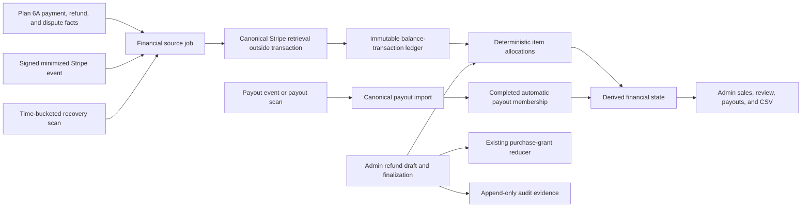

# Plan 6B: Stripe Financial Reconciliation and Reporting Design

**Date:** 2026-08-11

**Status:** Plan 6B implementation complete — protected global Sales link live

**Depends on:** Plans 1-6A, `2026-08-08-bookstore-full-stack-design.md`, and `2026-08-10-stripe-commerce-guest-claims-design.md`

## 1. Purpose

Plan 6B turns the durable commerce facts created by Plan 6A into an inspectable financial ledger and an administrator-only sales dashboard. It imports canonical Stripe balance transactions and payouts, separates customer-presentment facts from Stripe-settlement facts, allocates title-level amounts deterministically, resolves ambiguous refund allocation through an audited draft-and-finalize workflow, and reports estimated payout revenue without inventing mixed-currency totals.

Plan 6B does not replace Plan 6A's checkout, payment, claim, refund, dispute, or entitlement authority. Financial ingestion, reporting, and reporting-only correction never grant or revoke access. The only Plan 6B operations allowed to affect access are explicit finalization of an ambiguous refund allocation through the existing locked purchase-grant reducer and activation or deactivation of the narrowly scoped administrative recovery grant defined below.

The established purchase model remains unchanged: a cart can contain multiple titles, each title is a one-time quantity-one purchase, order currency is uniform, storefront prices exclude tax, and Stripe calculates configured tax at Checkout.

Production remains in maintenance mode through Plan 6B. Plan 7 still owns launch readiness, general failed-job administration, monitoring and alerting, backup automation, deployment hardening, and the Hetzner production launch.

The completed implementation is migrated through `0014`: migration `0012` retains its historical eight callable public boundary routines, `0013` adds the ninth, and `0014` adds fail-closed runtime-authority and source-parity protection to the financial issue-transition boundary without changing the callable surface. Its exact pairwise-distinct principals are `DATABASE_OWNER_USER`, `DATABASE_USER`, `DATABASE_WORKER_USER`, and `DATABASE_STORAGE_CLEANUP_USER`. The web principal may submit a command, read its owner-scoped status, and record the route-authorized audit boundary; only the financial worker may execute the protected mutation. Release evidence remains ordered migrate → provision → checkpoint capture → distinct-engine rehearsal → smoke. See the [financial reconciliation and reporting operator guide](../../financial-reconciliation-and-reporting.md).

## 2. Goals

The completed Plan 6B implementation provides:

- A normalized, minimized local ledger of Stripe balance transactions and payouts.
- Separate customer-presentment and Stripe-settlement currency domains.
- Exact processing-fee, refund, dispute, and payout evidence without floating-point money arithmetic.
- Deterministic per-order-item allocations with exact minor-unit conservation.
- Durable, inspectable reconciliation issues instead of silent guesses or endless retries.
- Automatic reconciliation recovery through webhook-triggered work and bounded recurring scans.
- A shared administrator workflow for drafting and finalizing ambiguous refund allocations.
- Append-only reporting corrections that cannot silently rewrite access history.
- Per-title copies, gross sales excluding tax, refunds, dispute effects, fees, and estimated payout revenue.
- Automatic-payout membership after Stripe reports reconciliation completion.
- Clear fee-only treatment for manual and instant payouts.
- A privacy-safe aggregate CSV using the active sales filters.
- Audited financial detail views, exports, and mutations.
- Unit, PostgreSQL integration, route, browser, privacy, migration, and production-image verification.

## 3. Non-goals

Plan 6B does not implement:

- Formal accounting, general-ledger bookkeeping, tax advice, tax filing, or bank-statement reconciliation.
- Currency conversion for presentation, a house exchange rate, or any cross-currency grand total.
- An application refund-creation or dispute-response interface. Those actions remain in Stripe Dashboard.
- Subscription, bundle, quantity, promotion, invoice, saved-payment-method, billing-portal, marketplace, or Connect-seller features.
- Customer-facing financial reports.
- Transaction-level or PII-bearing CSV exports.
- Attribution of unrelated Stripe-account activity to bookstore titles.
- Manual assignment of transactions to manual or instant payouts.
- Manual Stripe synchronization, general job retry, or full worker-management controls; Plan 7 owns those controls.
- Opening the production storefront, CI/CD, monitoring alerts, backup automation, or broader Hetzner operations.
- Redis, another queue, or a new runtime service.
- Real Stripe credentials in automated tests.

## 4. Chosen architecture

### 4.1 Ledger-first modular design

Plan 6B extends the existing modular SvelteKit monolith:

- `commerce/stripe` exposes narrow canonical Charge, Refund, Dispute, BalanceTransaction, and Payout snapshots. No route, job, report, or component depends on raw Stripe SDK objects.
- `commerce/financial/import` validates provider-to-local linkage and persists minimized provider facts.
- `commerce/financial/allocations` owns signed largest-remainder allocation and exact conservation checks.
- `commerce/financial/reconciliation` derives source and payout state from complete durable evidence.
- `commerce/financial/refund-review` owns shared drafts, one-way finalization, reporting-only corrections, and purchase-grant projection.
- `commerce/financial/scans` owns time-bucketed scheduling, bounded local scans, payout backfill, and durable cursors.
- `commerce/reporting` owns strict filters, per-title aggregates, payout views, safe DTOs, keyset pagination, and CSV serialization.
- `/admin/sales` and its child routes remain thin SvelteKit adapters over authorized server services.

PostgreSQL remains the database, queue, scheduler checkpoint, lock authority, and audit store. Stripe calls occur outside database transactions. No Redis service is introduced.

### 4.2 End-to-end flow

Webhook delivery is the fast path. Durable local and payout scans are the recovery path. Reports read only local durable state and never make live Stripe calls.

### 4.3 Delivery checkpoints

Plan 6B is one design delivered through two implementation checkpoints:

- **6B-I — Financial ingestion and reconciliation:** schema, canonical provider DTOs, payout webhooks, recurring scans, ledger imports, allocations, issues, migration, backfill, and focused verification.
- **6B-II — Admin resolution and reporting:** capabilities, sales overview, refund review, payout views, reporting corrections, CSV, audit, accessibility, documentation, and full release gates.

Checkpoint I passed its bounded independent review before checkpoint II began. The checkpoints formed one candidate phase during implementation, and neither checkpoint is a separately released product surface.

The completed implementation combines checkpoint I’s ingestion/reconciliation work with checkpoint II’s administrator resolution/reporting routes, payout views, corrections, recovery grants, and CSV. The direct routes remain protected administrator surfaces, and global administrator navigation now exposes the live protected **Sales** link. Production remains in maintenance mode with Stripe disabled, and Plan 7 retains activation and operability ownership. See the [Stripe financial reconciliation operations guide](../../stripe-financial-reconciliation.md) for its runtime and recovery boundary.

## 5. Financial authority and currency model

### 5.1 Sources of authority

The application uses three distinct authorities:

- Immutable `orders` and `order_items` snapshots are the authority for customer-presentment subtotal, tax, total, title, creator, format, and the sale cohort identified by `orders.paid_at`.
- Stripe Balance Transactions are the authority for settlement-currency gross movement, fee, net, availability, reporting category, and FX evidence. Stripe defines `net = amount - fee`; Plan 6B verifies this for every imported row. See [the Balance Transaction object](https://docs.stripe.com/api/balance_transactions/object).
- Completed automatic-payout membership returned by the Balance Transactions API with a payout filter is the authority for exact payout association. See [Stripe payout reconciliation](https://docs.stripe.com/payouts/reconciliation).

Browser redirects, webhook amount fields, current catalog prices, formatted UI values, Stripe Dashboard screenshots, local estimates, and provider descriptions are never financial authority.

### 5.2 Presentment and settlement domains

Every monetary value belongs to an explicit domain:

- **Presentment:** order, item, refund-allocation, and dispute values in the currency the customer paid.
- **Settlement:** balance-transaction, fee, adjustment, and payout values in the Stripe balance currency.

Unlike currencies are never summed or subtracted. APIs, DTOs, tables, audit summaries, and CSV columns carry an uppercase currency code with every monetary group. Same-currency rows may render compactly, but the stored domains remain explicit.

Provider adapters normalize Stripe's lowercase codes to the application's uppercase form and use the existing reviewed ISO exponent helper for zero-, two-, and three-decimal currencies. No code assumes two decimals. See [Stripe supported currencies](https://docs.stripe.com/currencies).

When Stripe supplies an exchange rate, Plan 6B stores it only as bounded exact decimal evidence in a PostgreSQL `numeric` value. JavaScript floating point is never used to derive money. Actual Stripe settlement amounts, not a recomputed conversion, are allocated and reported. Stripe documents that a Balance Transaction can use a different currency from the originating payment and exposes `exchange_rate` as evidence; the actual `amount`, `fee`, and `net` remain the settlement facts. See [the Balance Transaction object](https://docs.stripe.com/api/balance_transactions/object).

### 5.3 Reporting interpretation

Customer-sale metrics remain presentment facts. Estimated payout is a settlement-domain figure constructed from allocated actual settlement movements. If presentment and settlement currencies differ, the UI shows both domains with explicit labels and never presents one as a converted equivalent of the other.

Taxes are recorded separately and excluded from title revenue. Plan 6B is operational reporting, not an accounting opinion.

## 6. Orthogonal state models

Provider lifecycle, refund allocation/access, and financial settlement are separate dimensions.

### 6.1 Provider lifecycle

Plan 6A payment, refund, dispute, order, grant, and Stripe-event states retain their existing meaning. Plan 6B does not overload them with reporting status.

### 6.2 Refund allocation state

A dedicated `refunds.allocation_status` column and PostgreSQL enum record:

- `not_applicable`: the refund is not currently succeeded.
- `needs_review`: a succeeded refund cannot be attributed automatically.
- `draft`: an editable administrative proposal exists but has no effect.
- `finalized`: automatic or administrative allocations are immutable and access-effective.
- `exception`: durable local facts conflict and finalization is unsafe.

Automatic single-item and full-order allocations enter `finalized`. Failed or canceled refunds can still have financial reversal evidence, but their access-allocation state is `not_applicable`.

### 6.3 Financial evidence and derived settlement state

Payments, refunds, and disputes persist a payout-independent `financial_evidence_status`:

- `pending`: required Stripe financial evidence or allocation is incomplete.
- `fee_reconciled`: relevant balance transactions and title/account classifications are complete.
- `exception`: durable evidence conflicts, is unsupported, or cannot be safely classified.

The public financial state is then derived from that status plus current authoritative payout evidence. A `fee_reconciled` source is exposed as `payout_reconciled` only when every relevant transaction has authoritative membership in a reconciliation-completed supported automatic payout whose current canonical status is paid. `payout_reconciled` is deliberately not cached on a purchase source, so concurrent payout publication or failure cannot leave a stale source row claiming settlement. Reports and DTOs always join the current payout and membership rows.

A late payout failure, failed-refund reversal, new dispute transaction, or immutable collision therefore reopens the derived state to `fee_reconciled`, `pending`, or `exception` while preserving earlier ledger and payout membership as history. Stripe notes that a payout can initially appear paid and later fail, so `paid` is not treated as irreversible. See [the Payout object](https://docs.stripe.com/api/payouts/object).

The migration replaces Plan 6A's `pending | reconciled | exception` seam with `financial_evidence_status`. Both legacy `pending` and legacy `reconciled` map to `pending`, because Plan 6A did not import the balance-transaction and classification evidence required to prove `fee_reconciled`; canonical backfill must establish that state. Existing `exception` is never mapped mechanically. Succeeded refunds are classified from their complete locked allocation graph: complete allocations become `finalized`, ambiguous unallocated refunds become `needs_review`, and financial evidence begins `pending` until provider evidence is imported.

### 6.4 Deterministic state table

| Durable condition | Allocation state | Financial state |
| --- | --- | --- |
| Required canonical source or balance transaction is not yet available, including a retryable provider gap | Existing value | `pending` |
| Succeeded ambiguous refund has complete provider facts but no finalized title allocation | `needs_review` or `draft` | `pending` |
| Provider, allocation, and fee facts are complete but no qualifying paid automatic payout membership exists | `finalized` or `not_applicable` | `fee_reconciled` |
| Complete facts belong to a standard automatic payout whose membership is published, reconciliation is completed, and current status is paid | `finalized` or `not_applicable` | `payout_reconciled` |
| Manual or instant payout has complete source facts | Existing value | `fee_reconciled` |
| Payout failed, canceled, or reversed and its reversal evidence is not yet complete | Existing value | `exception` |
| Failed/canceled payout reversal is completely imported with no remaining conflict | Existing value | `fee_reconciled` |
| Immutable collision, impossible money/currency relation, unsupported safety-critical evidence, or allocation over-cap exists | Existing value | `exception` |

An expected ambiguous refund uses `needs_review + pending`; it is not a financial exception. Its safe queue entry can use `allocation_incomplete` with issue impact `pending`. Only an open issue whose impact is `exception` forces financial state `exception`. Issue acknowledgment alone never changes either state.

## 7. Data model

### 7.1 Stripe balance transactions

`stripe_balance_transactions` stores one minimized row per unique provider transaction:

- Internal UUID and unique bounded Stripe Balance Transaction ID.
- Livemode flag.
- Nullable bounded source ID and normalized source family.
- Bounded raw provider `type` and `reporting_category` values. Normalized classifications are stored separately in the append-only versioned classification ledger described below; a novel raw value initially receives `unknown` without mutating the provider fact.
- Signed `amount_minor` and `net_minor`, nonnegative `fee_minor`, uppercase settlement currency, and the invariant `net_minor = amount_minor - fee_minor`.
- Provider status `pending | available`; only validated `pending -> available` changes are permitted.
- Balance type, provider-created timestamp, availability timestamp, and optional positive `numeric(38,18)` exchange-rate evidence with explicit presentment-source and settlement-target currencies.
- Import timestamps and immutable-field digest used for collision diagnostics.

Source family is established through canonical object linkage, never inferred from an ID prefix alone. Amount and net may be negative. The schema uses bounds compatible with JavaScript safe integers and the project's provider amount ceilings.

An optional child table stores bounded raw fee-detail type, amount, and currency. It excludes fee descriptions, Connect application identifiers, and raw objects. `financial_classification_versions` stores append-only decisions for a balance transaction or fee-detail row: subject type and ID, monotonically increasing application classifier version, normalized classification, source fingerprint, and decision timestamp. The current decision is the highest supported classifier version for the unchanged source fingerprint; earlier `unknown` decisions remain immutable evidence. Novel provider or fee-detail values are retained, classified as `unknown`, and atomically open an `unsupported_category` reconciliation issue keyed to that exact classification-row ID rather than being silently discarded or guessed. That row-specific issue is permanent historical truth even after a newer classifier supports the evidence. Stripe recommends `reporting_category` for accounting-oriented classification. See [Stripe reporting categories](https://docs.stripe.com/reports/reporting-categories).

### 7.2 Stripe payouts

`stripe_payouts` stores:

- Internal UUID and unique bounded Stripe Payout ID.
- Livemode, signed amount, uppercase currency, automatic flag, and method `standard | instant | unknown`.
- Canonical provider status, reconciliation status, created timestamp, expected arrival date, and retrieval timestamp.
- Nullable payout balance-transaction, failure-balance-transaction, original-payout, and reversal-payout IDs.
- A normalized safe failure code when available, but never a provider failure message, destination, statement descriptor, metadata, or raw response.
- A nonnegative `financial_generation` bounded to a PostgreSQL signed 32-bit integer, initialized to zero and incremented exactly once whenever canonical lifecycle fields or published membership change in a way that can affect reporting. Reaching the bound fails closed as a reconciliation exception rather than wrapping.

Payout lifecycle fields may change only through a validated canonical refresh. Historical membership is not deleted if a payout later fails or reverses; current state reopens and the reversal evidence is imported.

### 7.3 Payout membership and import runs

`stripe_payout_balance_transactions` is an immutable, authoritative association between one payout and one balance transaction. A balance transaction can have at most one supported payout membership.

`payout_import_runs` records one active generation per payout with state `collecting | publishable | published | abandoned | exception`, bounded page cursor, counts, and timestamps. `payout_import_run_entries` stores run-scoped candidate transaction IDs and never appears in authoritative membership queries.

Each page commits entries and the next cursor idempotently. Observing the final page moves the run to `publishable`. One atomic publish transaction locks the payout, run, sorted candidate transactions, and existing authoritative membership; validates the complete candidate set; inserts `stripe_payout_balance_transactions`; and marks the run `published`. Only this transaction consumes the final one-payout-per-transaction uniqueness constraint. A crash resumes the same collecting run. A canonically changed or irrecoverably conflicting run becomes `abandoned` or `exception`, remains non-authoritative, and a later generation can restart safely.

The application retains every minimized balance transaction returned for an in-scope completed payout, including account-level and unrelated activity. Only canonically linked bookstore sources receive title allocations. Application-linked totals are not required to equal the payout total because a Stripe account can contain other activity.

### 7.4 Item financial allocations

`financial_allocation_sets` defines what one settlement allocation must conserve:

- One balance transaction.
- Basis `gross_amount | fee`.
- Scope `title | account | unresolved`.
- Expected signed effect, currency, algorithm version, source fingerprint, stable identity, and an optional superseded-set reference.

For `gross_amount`, expected signed effect equals provider `amount_minor`. For `fee`, expected signed effect equals `-fee_minor`; provider fee is stored nonnegative, while its reporting effect is negative. Therefore the gross and fee set effects sum exactly to provider `net_minor`. Fee credits represented by separate provider transactions retain those transactions' own signed effects.

`financial_item_allocations` contains append-only title-scoped rows from one allocation set to one order item. Each row records:

- Allocation-set and order-item IDs.
- A normalized component such as sale subtotal, sale tax, processing fee, refund subtotal, refund tax, refund fee, refund-failure reversal, dispute subtotal, dispute tax, dispute fee, or reinstatement.
- Signed effect, uppercase currency, stable tie-break key, and creation timestamp.

Unique allocation-set constraints prevent replay from inserting the same result twice. Title rows must sum exactly to their set's expected signed effect. Account-scoped sets carry the complete expected effect without title rows. Unresolved sets carry no allocations and force an issue. No fee-detail classification can make part of provider `fee_minor` disappear from the net equation. When a newer classifier or allocation algorithm changes a projection, it appends a set that references the exact prior chain tip; the current reporting view selects only the unique highest supported chain tip for each source and basis. A stale or forked supersession attempt becomes an issue, so old and new sets can never be double-counted.

Presentment-domain facts remain structurally separate. Existing order-item snapshots provide sale subtotal and tax. `refund_allocation_components` records finalized presentment refund subtotal/tax. `dispute_item_allocations` records canonical presentment dispute withdrawal/reinstatement subtotal/tax. Settlement rows always reference a balance transaction; presentment rows never pretend to be provider settlement evidence.

### 7.5 Reconciliation issues

`financial_reconciliation_issues` stores one current durable issue per resource scope and safe reason code:

- Resource type and internal resource ID.
- Safe code such as `immutable_mismatch`, `currency_mismatch`, `missing_source`, `unsupported_category`, `allocation_incomplete`, or `payout_membership_conflict`.
- `open | resolved` state, impact `pending | exception | informational`, first/last observation timestamps, occurrence count, and correlation ID.
- Nullable resolving administrator and resolution timestamp for admin-resolvable cases.

Provider messages, payloads, descriptions, customer identity, and payment-method data are forbidden. Re-observing the same issue increments safe evidence instead of creating unbounded duplicate rows. Resolution never deletes the issue; audit records preserve the transition. There is no generic administrative Resolve action. An ordinary issue closes only when canonical recomputation proves the invariant after new provider evidence, refund finalization, or a validated reporting correction. The `financial_classification + unsupported_category` pair never resolves because it describes one immutable historical decision; a supported replay appends a different row and removes the old row only from active diagnostics. Mere acknowledgment cannot hide a conflict or advance state.

### 7.6 Refund drafts, components, and corrections

`refund_allocation_drafts` stores at most one shared active draft for a refund, with an optimistic version and creating/updating administrator timestamps. `refund_allocation_draft_items` stores proposed total-presentment minor units per order item. Drafts remain until finalized or explicitly discarded; they do not expire by wall clock.

Drafts are visible to all administrators with reconciliation authority. Editing a stale version returns a conflict and reloads the current draft. A provider or purchase-graph change can make a draft non-finalizable without deleting it.

Finalization creates existing immutable `refund_allocations` plus new immutable `refund_allocation_components` rows. The original amount remains total including tax; the component rows make pre-tax reporting exact. Automatic Plan 6A allocations are backfilled with the same component representation.

`refund_reporting_correction_sets` and `refund_reporting_correction_items` store post-finalization append-only signed corrections. A correction set must be zero-sum independently for each domain, source allocation set, and currency. Subtotal and tax deltas may offset one another when corrected item attribution changes the tax split, but every corrected effective item component must remain within the original paid subtotal/tax capacities. The correction redistributes linked settlement gross attribution and, in a separate zero-sum compensating set, any refund-specific fee attribution whose deterministic weights depend on the corrected refunded subtotal. It never changes the provider fee total or classification, original charge-processing-fee allocation, unrelated fee allocation, `refund_allocations`, purchase grants, refunded-copy classification, or effective access. Restoring revoked access requires the separate audited administrative-grant workflow defined below.

Each correction records the base allocation-set chain tip, predecessor correction, source fingerprint, and the administrator-approved absolute effective per-item distribution in addition to its signed deltas. If a classifier or allocation algorithm supersedes the base, a local rebase job locks the current base and correction tips and attempts to preserve that approved absolute distribution. When it remains valid, the job appends an audited `classifier_rebase` correction successor tied to the new base; its deltas are recomputed from the new base, so the current view selects exactly one compatible base-plus-correction tip. If capacity, currency, or source evidence makes the approved distribution invalid, no implicit correction is applied: a `correction_rebase_required` exception opens, affected settlement metrics become unavailable, and recovery-grant activation is disabled until an administrator creates a new valid correction. Old base and correction rows remain immutable and are never double-counted or silently discarded.

### 7.7 Administrative recovery grants and immutability

The entitlement-grant source enum adds `administrative`. An administrative grant has a user and title, no purchase order-item source, bounded reason `refund_allocation_recovery`, and a unique reference to the exact administratively finalized refund allocation that authorized its creation. Eligibility requires both (a) durable finalization provenance proving that this administrative allocation, rather than an automatic allocation or an earlier legitimate full refund, was the transition that caused the exact purchase grant to become revoked and (b) a finalized reporting-correction chain proving the corrected attribution for that item is below its fully refunded threshold. Constraints require those fields only for `administrative`, forbid them for `purchase | preserved`, and prevent the grant from masquerading as either existing source.

Database protections enforce history, not only service convention:

- Balance-transaction and fee-detail provider facts reject direct updates; only `pending -> available` transaction status and import timestamps may change. Rows cannot be deleted. A changed code classification appends a new `financial_classification_versions` row rather than editing an earlier decision.
- Classification-version rows reject update and delete. A unique `(subject_type, subject_id, classifier_version, source_fingerprint)` identity and subject-level lock make concurrent classifier jobs converge on one decision.
- Payout provider identity and original facts are immutable; only enumerated canonical lifecycle, reconciliation, linkage, and retrieval fields may change. Rows cannot be deleted.
- Published payout membership, allocation sets/rows, finalized refund components, reporting-correction sets/items, and existing `refund_allocations` reject update and delete.
- Draft rows may change only before finalization. Finalization freezes the draft snapshot.
- Issues may change only occurrence and resolution lifecycle fields and cannot be deleted.

The migration implements these rules through constraints and database triggers comparable to the existing append-only audit protection. Direct SQL tests prove forbidden update/delete attempts fail and allowed lifecycle transitions still work.

## 8. Canonical Stripe adapter and webhook surface

### 8.1 Canonical snapshots

The provider adapter adds:

- `ChargeSnapshot`: charge ID, PaymentIntent ID, livemode, amount, currency, canonical balance-transaction ID, paid state, and provider-created timestamp.
- Extended `RefundSnapshot`: canonical balance-transaction and failure-balance-transaction IDs in addition to existing minimized fields.
- Extended `DisputeSnapshot`: zero, one, or two canonical balance-transaction references in addition to existing minimized fields. Stripe documents that dispute transactions represent withdrawal and reinstatement effects. See [the Dispute object](https://docs.stripe.com/api/disputes/object).
- `BalanceTransactionSnapshot`: the minimized fields defined in section 7.1.
- `PayoutSnapshot`: the minimized fields defined in section 7.2.
- Paginated `listBalanceTransactionsForSource`, `listBalanceTransactionsForPayout`, and `listPayouts` operations with bounded page size and opaque cursors.

Refund failure balance transactions are imported because Stripe uses them to return funds to the Stripe balance after a failed refund. See [Stripe refund behavior](https://docs.stripe.com/refunds) and [the Refund object](https://docs.stripe.com/api/refunds/object).

Every parser rejects unexpected livemode, unsafe identifiers, unsupported money bounds, invalid currency, malformed timestamps, impossible amount/fee/net relationships, and incompatible source linkage. Complete provider responses never leave the adapter.

### 8.2 Payout webhook allowlist

The explicit Stripe webhook allowlist adds:

- `payout.created`
- `payout.updated`
- `payout.paid`
- `payout.failed`
- `payout.canceled`
- `payout.reconciliation_completed`

The endpoint is never configured for `*`. `payout.reconciliation_completed` is the authoritative signal that transactions in an automatic payout can be queried; `payout.paid` alone is not that signal. See [Stripe event types](https://docs.stripe.com/api/events/types) and [payout reconciliation](https://docs.stripe.com/payouts/reconciliation).

The existing raw-body signature verification, API-version check, event digest collision handling, minimal `stripe_events` persistence, atomic event/job insertion, and immediate response behavior remain unchanged. The Stripe endpoint delivery API version is pinned to `2026-07-29.dahlia`, aligned with the repository's SDK gateway pin, and must stay aligned during future provider upgrades; see [Stripe API versioning](https://docs.stripe.com/api/versioning).

## 9. Jobs, recurring scheduling, and backfill

### 9.1 Job families and deduplication

The worker registers four financial job families:

- `commerce.financial-source`: reconciles one canonical charge, refund, dispute, or reversal source.
- `commerce.financial-payout`: retrieves one payout and, when supported, imports its paginated membership.
- `commerce.financial-scan`: creates bounded source and payout recovery work from durable local state and consumes generation-keyed payout-impact continuation phases.
- `commerce.financial-classification`: reclassifies immutable local raw evidence for one explicit application classifier version without calling Stripe.

Webhook-triggered jobs use the unique Stripe event ID in their deduplication key. Scan-triggered entity jobs include entity type, provider ID, and UTC-hour generation. Continuation jobs include a scan-run ID, phase, and digest of the opaque cursor. Classification jobs include classifier version, subject type, and subject ID. A terminal job from an earlier event, hour, or classifier version therefore cannot suppress later canonical changes.

The existing `commerce.stripe-event` job remains the only job inserted by webhook acceptance. Checkout, Refund, and Dispute reducers enqueue their corresponding `commerce.financial-source` job inside the same transaction that commits the Plan 6A local facts, completes the Stripe event with the existing reducer-derived terminal status (`processed` or `exception`), and appends its existing side effects. An expected ambiguous multi-title refund still completes the Plan 6A event as `exception`, but it enqueues financial work once its durable local refund fact exists; Plan 6B represents the orthogonal reporting state as `needs_review + pending`. The financial key uses a distinct namespace, `stripe:financial-source:event:<provider-event-id>`, so it cannot collide with `stripe:event:<provider-event-id>`. The financial worker therefore cannot race an uncommitted payment, refund, or dispute or rewrite Plan 6A event history.

For a payout event, the existing Stripe-event handler validates the descriptor and transactionally marks the event processed while enqueueing `commerce.financial-payout` with `stripe:financial-payout:event:<provider-event-id>`. The payout job performs canonical provider retrieval later. Duplicate webhook acceptance, event-job replay, and scan-triggered work all converge on the same provider-ID uniqueness checks.

### 9.2 Time-bucketed scheduler

When Stripe is enabled, each worker polling loop safely ensures that one root scan job exists for the current UTC hour. The key is `commerce.financial-scan:<UTC-hour>`, so the repository's permanent unique deduplication constraint becomes an asset instead of stopping recurrence. Concurrent workers converge on the same row through the existing unique constraint.

`financial_scan_runs` stores phase, bounded cursor/checkpoint, frozen payout-discovery time bounds, counts, start/completion timestamps, and safe outcome. A singleton `financial_payout_discovery_state` stores the completed coverage high-water. Each job processes at most 100 local resources or one provider page before committing progress and enqueueing a continuation. No loop holds a worker lease or database transaction across unbounded work.

The hourly scan covers:

- Pending and retryable-exception payments, refunds, and disputes.
- Incomplete payout import runs.
- Payout lifecycle using a frozen provider window and a 72-hour overlap from the durable completed-coverage high-water; the high-water advances only with the terminal page, so an outage longer than 72 hours cannot create a permanent gap.
- Initially, payouts from seven days before the earliest local paid order; the application does not import unrelated pre-store account history.

If a bounded job exhausts transient retries, the durable resource remains pending and the next hourly generation can try again. Permanent evidence conflicts remain exceptions until evidence changes or an authorized workflow resolves them.

Unsupported classifications are not retried every hour. On deployment of a new classifier version, each worker safely ensures one version-keyed classification scan exists. That bounded scan appends new classification decisions for unchanged raw facts, replays affected allocation sets through a new algorithm/version identity, rebases any compatible approved correction distribution, and recomputes linked issues and reports. A supported new row clears the subject from active diagnostics only after the new decision, correction compatibility, and exact allocation invariants commit; it never resolves the prior row's permanent `unsupported_category` issue. Earlier classification, allocation, correction, and row-scoped issue history remains immutable; a new code version never edits history or silently blesses a changed source fingerprint.

Stripe-disabled startup does not enqueue provider jobs and requires no Stripe secret. Fixture mode remains test-only.

### 9.3 Provider-call boundary

Every Stripe retrieve or list call completes before a database transaction begins. Paginated payout work makes one bounded provider call, persists that page and cursor in a short transaction, then releases the connection before requesting another page.

`balance.available` is not used as the sole recovery trigger because Stripe documents that it is not emitted for negative transactions. Webhooks, local pending scans, and payout backfill together provide convergence. See [Stripe event types](https://docs.stripe.com/api/events/types).

## 10. Source reconciliation and concurrency

### 10.1 Payment and charge sources

A payment source job:

1. Loads enough unlocked local identity to request canonical Stripe state.
2. Retrieves the PaymentIntent, latest Charge, and linked Balance Transaction outside a transaction.
3. Validates livemode, PaymentIntent, order metadata, charge identity, amount, currency, and paid evidence against Plan 6A.
4. Persists or validates the minimized balance transaction in an independent staging transaction.
5. Enters the order graph in the global lock order, re-reads every local fact, creates deterministic item allocations, recomputes issues and financial state, and appends a minimized audit outcome atomically.

The charge balance transaction does not include later refund or dispute effects; those are imported from their own canonical sources. See [the Charge object](https://docs.stripe.com/api/charges/object).

### 10.2 Refund sources

A refund source job retrieves the complete canonical refund, including current status, primary balance transaction, and failure balance transaction. It validates the PaymentIntent, amount, currency, livemode, and existing local refund under the locked order graph.

Succeeded-refund financial facts can be captured before title allocation is final, but title reporting remains incomplete and the resource remains `pending` with allocation state `needs_review` or `draft` and an `allocation_incomplete` pending-impact issue. Failed-refund reversal transactions are retained and allocated only from complete durable refund evidence; they never delete the original refund transaction.

### 10.3 Dispute sources

A dispute source job retrieves the complete canonical dispute and its zero, one, or two balance transactions. It validates PaymentIntent, charge, amount, currency, livemode, and chronology, then processes every observed withdrawal or reinstatement in provider-created order. Out-of-order events converge because the job reduces the complete canonical object, not the event delta.

Financial dispute allocation never calls the entitlement reducer. Plan 6A remains the sole authority for open, won, or lost access behavior.

### 10.4 Payout and account sources

Payout pages can contain balance transactions unrelated to local orders. Canonically linked Charge, Refund, and Dispute sources enter their appropriate source jobs. Payout, fee, adjustment, or novel sources without a proven order link stay in the account-level bucket. Unsupported or internally conflicting categories also open an issue; they are never assigned to a title.

### 10.5 Published global lock order

Provider facts are staged and committed before any purchase-graph transaction, preventing a balance-transaction lock from being held while waiting for an order.

Every transaction that combines purchase and financial rows uses:

1. Operation-local event identity, when applicable.
2. Order advisory lock.
3. Order.
4. Payment.
5. Refunds.
6. Relevant refund-allocation draft, then its draft items.
7. Finalized refund allocations, then their component rows.
8. Reporting-correction sets, then their correction items.
9. Disputes, then dispute item-allocation rows.
10. Order items.
11. Applicable payouts in stable-ID order when current membership is consulted.
12. Sorted balance transactions.
13. Classification-version rows in stable subject/version order.
14. Financial allocation sets, then their item-allocation rows.
15. Reconciliation issues.
16. Sorted user/title entitlement scopes.
17. Purchase and administrative grants.

Multi-row locks at every level are sorted by stable IDs. Administrative finalization discovers a draft without locking it, enters through the order lock, then re-reads and locks the draft and draft items at the published position. A source recomputation that consults payout membership locks and revalidates the applicable payout and its generation before locking balance transactions, so payout publication and purchase recomputation share `payout -> balance transaction` ordering.

Payout import never enters a purchase graph while holding payout locks. It locks the payout, import run, run entries, sorted balance transactions, published membership rows, and then payout-scoped issue rows. Publication or any canonical payout lifecycle change increments `stripe_payouts.financial_generation` and inserts a bounded `commerce.financial-scan` payout-impact continuation in the same transaction, using `financial:payout-impact:<payout-id>:<generation>` as its permanent deduplication key. The continuation pages application-linked memberships and enqueues independent source refresh work; a crash cannot lose the durable handoff. Purchase recomputation may hold an order while waiting for the applicable payout, but it locks and revalidates that payout generation before any balance transaction and the payout path never waits for an order, preventing a cycle. The public payout-derived state is read from current payout/membership rows rather than the asynchronously refreshed source cache, so a committed payout failure reopens the report immediately.

## 11. Deterministic financial allocation

### 11.1 Signed largest remainder

The shared allocator accepts one safe-integer signed amount, nonnegative integer weights, and stable unique keys. It:

1. Uses `BigInt` intermediates.
2. Allocates the absolute value by integer quotient.
3. Distributes remaining minor units by descending fractional remainder and then stable key.
4. Applies the original sign to every result.
5. Verifies the exact signed sum and safe-integer output bounds.

A nonzero source with no positive weight is an exception. A single positive weight receives the complete source. Negative values and fee credits use the same sign-aware contract rather than a positive-only helper.

### 11.2 Charge gross, tax, and processing fee

For a charge balance transaction:

- The `gross_amount` allocation set targets provider `amount_minor` and is allocated across all item subtotal and item tax components using their exact presentment snapshots as weights. This conserves provider gross and produces separate settlement subtotal and tax components without recomputing FX.
- The `fee` allocation set targets `-fee_minor` and allocates every fee cent across order items by immutable item subtotal excluding tax, as required by the program roadmap.
- Fee-detail categories separate processing, dispute, refund, tax-on-provider-fee, credit, and other safe classifications. Customer sales tax alone is excluded from title revenue; a tax charged on a provider fee remains part of fee impact. The dashboard labels processing and dispute fees explicitly and can show a separate Other Stripe fees impact.
- A novel detail opens an issue but remains allocated within the complete fee set as `other`, so the estimate cannot omit it or stop reconciling to provider net.
- In a same-currency order whose provider and order amounts are equal, the component allocation must exactly reproduce the order-item snapshots.

### 11.3 Refund allocation and tax split

An administrative draft assigns total presentment amount, including tax, to each item. Finalization splits each proposed item amount across that item's remaining refundable subtotal and tax capacities using signed largest remainder. Validation guarantees:

- Draft totals equal the succeeded refund amount exactly.
- Per-refund allocations never exceed the refund.
- Cumulative access-effective allocations never exceed an item's paid total.
- Subtotal and tax components never exceed their remaining item capacities.
- All currencies and the complete order/refund graph agree.

The associated settlement refund balance transaction is allocated across the finalized item subtotal/tax components as weights. Any refund fee is allocated by finalized refunded subtotal. A failed-refund reversal mirrors the original allocation set when amounts match; otherwise it uses the original set as deterministic weights and remains independently conserved.

If an ambiguous unallocated refund fails and its original principal movement and failure reversal cancel exactly, both gross sets reconcile to zero at account level without inventing title attribution or changing access. Any provider fee set is still allocated by immutable payment-item subtotal because that basis does not claim which item was refunded. A residual principal or FX mismatch remains an exception until it can be classified safely.

Saving or discarding a draft changes no report, financial state, grant, entitlement, or customer email. Finalization creates immutable rows, recomputes purchase grants and effective entitlements in the same transaction, and queues an access-change email only when effective access actually changes. Another active purchase or preserved grant can keep access active.

Finalization is one-way. Reporting corrections create zero-sum compensating sets per domain, source allocation set, and currency. They can change which title and subtotal/tax component bears a refund in financial reports and can redistribute only the refund-specific fee attribution that was derived from that corrected subtotal basis. They cannot change any provider fee total or classification, original charge-processing-fee allocation, unrelated fee allocation, access-effective `refund_allocations`, refunded-copy classification, purchase-grant state, or original audit evidence.

### 11.4 Dispute withdrawal, fee, and reinstatement

Dispute withdrawals for one payment are processed across every dispute and transaction in stable `(provider_created_at, provider_transaction_id)` order. Each provider transaction has its own allocation-set identity.

For the first unmatched withdrawal of a dispute, the canonical Dispute amount creates presentment subtotal/tax rows, while the actual withdrawal Balance Transaction creates settlement rows. Both use the order items' remaining paid exposure after finalized successful refunds and prior still-outstanding dispute withdrawals. Earlier reinstatements restore exposure before a later withdrawal is allocated. A dispute fee is allocated by the affected subtotal exposure.

Aggregate outstanding dispute principal can never exceed the payment's remaining exposure. If no positive exposure exists for a nonzero source, or cumulative provider evidence exceeds that capacity, the resource enters exception rather than assigning money arbitrarily.

Each reinstatement references the exact withdrawal allocation set for the same dispute and uses that persisted allocation as its weights in each currency domain. A matching reinstatement reverses the title effect exactly; partial or provider-adjusted reinstatement remains independently conserved with stable rounding. If reinstatement arrives first, canonical retrieval processes the complete dispute transaction set in provider chronology.

Actual withdrawal balance movements reduce estimated payout immediately. Actual reinstatements restore it. Open, won, or lost labels do not fabricate a movement that is absent from the ledger.

### 11.5 Copy counts and account-level adjustments

- Sold copies equal paid order items in the reporting cohort.
- A refunded copy requires cumulative finalized access-effective succeeded-refund allocations equal to the item's paid total.
- Partial refunds affect money only.
- Net copies equal sold copies minus refunded copies.
- Reporting-only corrections do not change copy counts.
- Account-level adjustments affect payout/account summaries but never title metrics.

## 12. Payout reconciliation

### 12.1 Supported exact association

Exact membership is claimed only when all of these are true:

- The payout is automatic.
- The payout method is standard.
- Stripe reports `reconciliation_status = completed`.
- The payout's current canonical status is `paid`.
- Pagination using the payout filter reaches a complete final page.
- Every returned balance transaction passes canonical parsing, immutable collision checks, and unique-membership validation.

Stripe documents that the payout filter is available for automatic payouts and that manual payouts do not have Stripe-determined transaction membership. See [List Balance Transactions](https://docs.stripe.com/api/balance_transactions/list) and [payout reconciliation](https://docs.stripe.com/payouts/reconciliation).

Only after the complete import-run finalization transaction and a current paid-status recheck can associated application resources derive as `payout_reconciled`. A pending or in-transit payout with complete membership derives as `fee_reconciled`; a later failure, cancellation, or reversal reopens the report immediately because payout status is joined at read time. The same payout mutation transaction increments its generation and durably enqueues bounded impact work for source-level issue and reversal refresh.

### 12.2 Manual and instant payouts

Manual payouts and instant payouts remain `fee_reconciled` when source balance transactions are complete. The UI labels them `not payout reconciled` and keeps title revenue estimated. There is no manual membership assignment in Plan 6B.

### 12.3 Failure, cancellation, and reversal

A later payout failure or cancellation preserves the original payout and membership rows, imports failure/reversal balance transactions, and reopens affected current state. The Payouts view shows the lifecycle change and safe reason code. No previously imported provider fact is deleted.

## 13. Reporting semantics

### 13.1 Cohorts and time boundaries

Sales cohorts use `orders.paid_at`, never settlement date or current catalog metadata. The default range is the last 30 complete UTC days using a half-open interval:

- `to` is the start of the current UTC day.
- `from` is 30 UTC days before `to`.

Quick presets provide 7, 30, and 90 complete UTC days plus all time. Payout views use provider settlement and arrival timestamps separately and label them explicitly.

### 13.2 Per-title metrics

Overview rows group by stable title ID, presentment currency, and nullable settlement currency. A source whose balance transaction is not yet available appears in a labeled `Settlement pending` group rather than borrowing the presentment currency. Rows display the current title name and archive state while retaining immutable sold-as title, creator, and format snapshots for detail and export evidence.

Each row also exposes `settlement_metrics_complete` and `missing_source_count`. If any title-affecting source is missing, conflicting, or not safely attributable—including an ambiguous refund that could affect any item in the order—every settlement effect and `estimated_payout_minor` for the affected title rows is `null`, never zero or a known-to-date value that could overstate revenue. Presentment sales and already-finalized presentment facts remain visible. Only complete `fee_reconciled` or `payout_reconciled` rows expose settlement numeric metrics; an informational issue that does not affect money completeness does not null them.

Each row reports:

- Sold, fully refunded, and net copies.
- Presentment gross subtotal excluding tax.
- Presentment finalized refund subtotal.
- Presentment dispute withdrawal and reinstatement subtotal.
- Settlement gross subtotal excluding allocated tax.
- Settlement refund and dispute movements.
- Allocated processing, refund, dispute, and other Stripe fee impacts.
- Settlement estimated payout.
- Aggregated financial state and data-freshness timestamp.

The same-currency presentation may collapse duplicate labels. FX rows show both domains. Unlike currency pairs remain separate rows and summary groups.

The query and DTO use one sign convention: every settlement component is an `effect_minor` on title revenue. Sales subtotal is positive; refunds and withdrawals are negative; reversals, reinstatements, and fee credits are positive; provider fees are negative. Customer sales-tax components are excluded.

When `settlement_metrics_complete` is true, the exact title estimate is:

`sum(sale_subtotal_effect + refund_subtotal_effect + dispute_subtotal_effect + every_order_linked_fee_effect)`

Each balance transaction contributes its gross set and fee set once, so refund and dispute fees cannot be hidden inside principal or subtracted twice. The DTO exposes signed `refund_impact_minor`, `dispute_impact_minor`, `processing_fee_impact_minor`, `refund_fee_impact_minor`, `dispute_fee_impact_minor`, and `other_fee_impact_minor`; their sum with settlement sale subtotal equals `estimated_payout_minor`.

The UI and CSV preserve those signs, using explicit minus and plus formatting for deductions and credits. A negative estimate remains a numeric negative value. Account-level adjustments appear only in payout/account summaries and are not included in title estimates.

Rows in `pending` or money-impacting `exception` display **Settlement estimate unavailable**, the missing-source count, and no numeric settlement total. Complete `fee_reconciled` rows label the figure **Estimated payout**. Only a row in `payout_reconciled` may label it **Payout reconciled**, and the underlying signed value remains derived from the same immutable allocations.

### 13.3 Aggregate state

A title row uses the least-complete contributing state:

1. Any open exception-impact issue yields `exception`.
2. Otherwise any incomplete source yields `pending`.
3. Otherwise any source without supported payout membership yields `fee_reconciled`.
4. Only a row whose contributing sources all have completed supported membership yields `payout_reconciled`.

The page states `Financial data through <timestamp>` using the last successful relevant scan. It never claims live provider state.

## 14. Admin Sales experience

### 14.1 Information architecture

The admin shell replaces the disabled Sales placeholder with one top-level **Sales** entry. Its local navigation contains:

- `/admin/sales` — Overview.
- `/admin/sales/review` — Needs Review.
- `/admin/sales/review/[issueId]` — read-only reconciliation-issue detail unless a named validated workflow is available.
- `/admin/sales/refunds/[refundId]` — refund allocation, reporting correction, and access-consequence detail.
- `/admin/sales/payouts` — Payouts.
- `/admin/sales/payouts/[payoutId]` — payout detail.
- `/admin/sales/export.csv` — aggregate export using Overview filters.

Breadcrumbs and return links preserve filters, sort, and pagination context. The pages define explicit empty, no-results, pending-only, stale-data, Stripe-disabled, unsupported-payout, and partial-reconciliation states.

### 14.2 Overview filters and pagination

Strict allowlisted single-value query parameters cover:

- `range=7 | 30 | 90 | all | custom`.
- `from` and `to` UTC dates in exact `YYYY-MM-DD` form when `range=custom`.
- Title ID.
- Format.
- Presentment currency.
- Settlement currency.
- Financial state.
- Sort and bounded cursor.

Preset ranges convert to the documented half-open UTC boundaries. `range=all` omits the lower paid-at bound and is mutually exclusive with `from`/`to`; custom range requires both dates and permits the complete stored history. Duplicate, unknown, malformed, inverted, oversized cursor, or incompatible parameters return a safe 400. Clear restores the approved 30-complete-day default.

The default ordering and cursor tuple are `(gross_presentment_minor DESC, title_id ASC, presentment_currency ASC, coalesce(settlement_currency, '') ASC)`. Every alternate sort appends the same stable title/currency identity. Keyset pagination is bounded, preserves all filters, and cannot skip or duplicate equal-gross rows for one title in multiple currency pairs.

Summary values are grouped by currency pair and never collapsed into a converted total. Each group has its own `settlement_metrics_complete` and summed `missing_source_count`. If any contributing title row is incomplete, presentment totals remain available but every settlement summary and estimated-payout value for that currency pair is `null`; SQL and DTO reducers must not silently omit null rows from a seemingly complete total. Titles with no paid item in the selected cohort are omitted; a selected title with no results receives a clear zero-sale empty state rather than fabricated financial rows.

### 14.3 Needs Review and refund finalization

Needs Review prioritizes ambiguous refunds, immutable evidence conflicts, unsupported classifications, and incomplete payout imports. Safe reason text explains whether an administrator can act or must wait for provider/job recovery. Plan 6B exposes no manual provider retry button.

The refund allocation detail shows:

- Immutable order and refund totals and currency.
- Every item, sold-as metadata, paid subtotal, tax, and total.
- Existing finalized allocation and remaining capacity.
- Editable proposed total and refund remainder.
- Draft version and last editor.
- A safe per-item consequence preview: whether the purchase grant would become revoked, whether another active grant would preserve effective access, and whether an access-change email would be queued.
- A non-color-only warning that finalization can revoke purchase access and cannot be reversed by editing the allocation.

Draft save, discard, and finalize are keyboard-complete native form actions. Finalization uses a dedicated accessible confirmation step, not `window.confirm`. Stale or changed facts return a conflict, retain the draft, explain what changed safely, and require review of refreshed values.

After finalization, the same refund detail can create a reporting-only correction. It shows the current effective reporting distribution and an editable proposed per-item total, then derives subtotal/tax and settlement effects for preview. Eligibility is limited to a finalized succeeded refund whose canonical balance transaction and current settlement allocations are complete, with reason code `allocation_attribution_correction`. Pending provider evidence or any unrelated immutable/currency conflict keeps the action read-only. The proposal must preserve the complete refund total in each domain, use an optimistic correction-chain version and source fingerprint, and pass the same currency/capacity checks. Confirmation states that the correction changes reports only and does not restore access. No free-form provider evidence or customer data is accepted.

There is no generic issue-resolution button. Immutable conflicts remain read-only until new canonical evidence resolves them. An unsupported classification row and its exact issue remain read-only forever; a newer application classifier version appends a supported decision and replays the affected reporting allocations, causing the historical issue to disappear from the active-only queue without changing its stored open state. Refund finalization or a valid reporting correction closes only its specifically linked issue as part of successful recomputation.

### 14.4 Administrative access recovery

Because refund finalization is intentionally one-way, Plan 6B adds a narrow, separate recovery workflow on an administratively finalized refund detail. It can create or reactivate an `administrative` entitlement grant only when locked provenance proves that the referenced administrative allocation was the causal transition that fully refunded and revoked the exact order item's claimed purchase grant and the finalized reporting-correction chain now places that item's corrected allocation below the fully refunded threshold. Automatic allocations, purchase grants already revoked before that finalization, unchanged legitimate administrative allocations, and ordinary full-refund outcomes are ineligible. The action uses the exact user/title pair from that purchase grant; it cannot search arbitrary users, alter the purchase grant, or change financial reporting. An unclaimed guest item has no eligible user and cannot receive recovery access until it is claimed.

The grant source enum and constraints distinguish `administrative` from migration-era `preserved` grants. A bounded reason `refund_allocation_recovery` links the action to the finalized refund and order item. A second confirmed action may deactivate only that recovery grant; it cannot mutate unrelated preserved or purchase grants.

Activation requires `reconciliation.manage` and enters through the order advisory lock and published purchase-graph order. It locks and revalidates the exact refund, administrative finalization provenance, allocation/components, current compatible correction-chain tip and fingerprint, and order item before entering the sorted user/title entitlement scope and grants. A concurrent correction or refund finalization therefore serializes before the eligibility decision. Deactivation may take the narrower entitlement-scope path because it changes only the already-linked administrative grant and does not infer eligibility from financial rows.

An activated recovery grant is an explicit persistent administrative access override. Later corrections, automatic refunds, disputes, or classifier rebases do not deactivate it implicitly, even if the item later becomes fully refunded again; the UI confirmation and audit record state that it remains active until a separate authorized deactivation. This persistence prevents a reporting or provider-ingestion operation from changing access as a side effect. The service projects effective access, queues email only if effective access changes, and commits grant, entitlement, outbox, and append-only audit evidence atomically. The UI previews the exact title and effective-access transition without exposing customer email.

### 14.5 Payouts

The Payouts section shows automatic/manual, standard/instant, current status, reconciliation status, settlement currency, amount, created/arrival dates, associated transaction count, bookstore-linked subtotal, account-level adjustment total, and freshness. Detail views distinguish total payout evidence from the bookstore-linked subset and never imply that they must be equal.

Manual and instant payouts show `Fee reconciled — exact payout membership unavailable`. Failed or reversed payouts retain historical membership and display their current exception or reversal state.

### 14.6 CSV export

CSV export uses the validated active Overview data filters and ordering but deliberately ignores the page cursor, exporting the complete matching aggregate result. It produces one row per stable title and presentment/settlement currency pair, including a blank settlement-currency field plus `pending` state when settlement evidence is unavailable. Stable columns include current title, stable title ID, currency domains, nullable signed minor-unit metrics, `settlement_metrics_complete`, `missing_source_count`, state, range, and a deterministic JSON array of distinct immutable sold-as title/creator/format variants observed in the cohort. Incomplete settlement numeric cells are empty rather than zero.

The export is limited to 10,000 aggregate rows, 10 MiB, and a bounded generation deadline; exceeding a bound returns a safe request-to-narrow-filters response and no partial file. It excludes customer identity, order/payment/refund/dispute/payout provider IDs, raw objects, audit metadata, and internal issue evidence.

Typed validated numeric columns serialize as canonical base-10 signed integers and are never formula-neutralized, so a legitimate negative estimate remains numeric. Formula neutralization applies only to text-origin columns. If character zero is tab, carriage return, or line feed, the value is neutralized immediately. Otherwise the scanner skips only ordinary ASCII spaces and neutralizes when the next character is `=`, `+`, `-`, `@`, tab, carriage return, or line feed. All fields then use RFC 4180 quoting; Unicode, commas, quotes, and newlines are preserved safely.

The response uses `text/csv; charset=utf-8`, a bounded ASCII attachment filename derived from the UTC date range, `Cache-Control: no-store`, and `X-Content-Type-Options: nosniff`.

## 15. Authorization, audit, privacy, and accessibility

### 15.1 Capabilities and request boundaries

The admin policy adds `sales.read`, `sales.export`, and `reconciliation.manage`. They initially map to the administrator role but preserve future separation of duty.

| Surface | Required service and route capability |
| --- | --- |
| Overview, Needs Review, issue/refund detail, Payouts, payout detail | `sales.read` |
| CSV | `sales.read` and `sales.export` |
| Draft save/discard/finalize, reporting correction, recovery-grant activation/deactivation | `sales.read` and `reconciliation.manage` |

Every layout, loader, detail query, form action, and export authorizes before parsing sensitive identifiers, querying financial rows, or doing provider work. Services repeat authorization so route protection is never the sole boundary. Mutations require the existing same-origin and CSRF protections. Anonymous and customer requests receive safe non-disclosing responses.

### 15.2 Audit events

Ordinary Overview browsing and filtering are not audited. The following are:

- Reconciliation and payout detail views.
- CSV export.
- Refund draft create, edit, and discard.
- Refund allocation finalization.
- Reporting correction creation.
- Recovery-grant activation and deactivation.
- Aggregate worker outcomes for balance-transaction import, payout association, issue creation, and issue resolution.
- Aggregate worker outcomes for classifier decisions, allocation supersession, compatible correction rebasing, and failed rebase exceptions.

Audit details contain internal resource IDs, safe reason/action codes, currency, aggregate minor amounts, counts, before/after state, actor, outcome, and correlation ID. They never contain email, provider descriptions/messages, raw Stripe objects, card or billing data, evidence, secrets, provider URLs, or CSV contents.

Every audited mutation commits its mutation and audit success in one transaction; this includes draft create/edit/discard, finalization, reporting correction, recovery-grant change, provider import state, payout publication, and issue transition. A forced audit failure rolls the mutation back. Detail DTOs and complete bounded CSV bytes are generated successfully before their view/export audit event commits; audit failure prevents the detail or file response.

### 15.3 Minimized DTOs and storage

Reports and routes return explicit safe DTOs rather than database or provider rows. Full provider IDs remain server-side and are not emitted by Plan 6B list, detail, or export surfaces. Logs use internal resource and correlation IDs.

No schema column stores Stripe descriptions, destinations, metadata, failure messages, customer/payment-method/card/address data, receipt URLs, dispute evidence, webhook bodies, or complete responses.

### 15.4 Accessibility and responsive behavior

Sales pages use semantic headings and landmarks, natively labeled controls, visible `:focus-visible` treatment, and status or alert live regions for asynchronous outcomes. Financial state and negative values always have text labels and never rely on color.

Tables include captions, scoped headers, right-aligned tabular numbers, currency codes, and an accessible narrow-screen wrapper or semantic card fallback that preserves row labels. Long titles, large amounts, zero- and three-decimal currencies, 200% zoom, 320-pixel width, keyboard-only operation, and reduced motion are verified.

Charts are not required for Plan 6B. If implementation adds one, the exact accessible table remains the primary equivalent and the chart cannot hide any required metric.

## 16. Error handling and observability

Typed domain errors map to stable safe responses, including:

- `FINANCIAL_INPUT_INVALID`
- `FINANCIAL_EVIDENCE_PENDING`
- `FINANCIAL_EVIDENCE_CONFLICT`
- `REFUND_ALLOCATION_STALE`
- `REFUND_ALLOCATION_INVALID`
- `REFUND_ALLOCATION_FINALIZED`
- `REPORTING_CORRECTION_STALE`
- `REPORTING_CORRECTION_INVALID`
- `ADMINISTRATIVE_ACCESS_INVALID`
- `PAYOUT_MEMBERSHIP_UNAVAILABLE`
- `FINANCIAL_PROVIDER_UNAVAILABLE`

Provider outages, timeouts, and rate limits are retryable. Immutable collisions, impossible currency/amount relationships, unsupported source categories, and exhausted safe attribution become durable issues. A permanent provider mismatch does not retry forever.

Structured diagnostics expose safe job type, internal resource ID, issue code, attempt, duration, counts, currencies, and correlation ID. They omit provider payloads and sensitive identity. Existing worker lease renewal, lost-lease handling, and bounded backoff apply.

The admin UI exposes source/payout freshness and current open issue counts. Current counts retain non-versioned resources, filter classification issues to the active classifier plus the subject's current raw fingerprint, and filter allocation-set issues to raw version-local tips under the active classifier/allocation pair; a separate historical inventory retains every immutable row-scoped diagnostic. Plan 7 will convert these signals into production alerts and general retry controls.

## 17. Configuration, migration, and deployment

### 17.1 Configuration

Plan 6B uses the existing Stripe secret key, webhook signing secret, livemode expectation, API version, and disabled-by-default production overlay. It may add bounded nonsecret settings for scan cadence, batch size, overlap, and initial backfill horizon, each with reviewed defaults.

No financial route or worker logs configuration values. The Stripe preflight remains mandatory before any production Compose command that creates Stripe-enabled containers.

### 17.2 Migration and backfill

The forward migration:

- Creates the ledger, raw fee details, append-only classification versions, payouts, provisional/published membership, import/scan runs, allocation sets, settlement item allocations, refund/dispute presentment components, drafts, corrections, administrative recovery grants, and issues.
- Separates refund-allocation state from financial settlement state.
- Migrates the financial enum and indexes pending/state/provider/date scan paths.
- Classifies existing Plan 6A refund allocation state from complete local facts.
- Preserves all orders, items, payments, refunds, allocations, disputes, grants, events, jobs, and audit history while installing append-only protection for finalized financial rows.
- Performs no network access and does not mark historical records reconciled without provider evidence.

After migration, the worker creates bounded financial backfill work. Local payment/refund/dispute sources are the initial queue; payout discovery begins from the approved local-history boundary. It also creates one version-keyed local classification scan for the deployed classifier version. Backfill is safe to interrupt and replay.

Upgrade tests execute the real prior schema through the new migration with representative Plan 6A payments, automatic and ambiguous refunds, disputes, existing exception states, and preserved grants. They prove exact mapping, repeated migration-runner safety, restrictive history, fresh-install behavior, and transaction rollback on invalid legacy facts.

Backup and restore documentation adds every Plan 6B table and post-restore invariants for missing ledger rows, orphan membership, allocation conservation, open issues, and scan checkpoints.

### 17.3 Deployment boundary

Production remains `APPLICATION_MODE=maintenance`. Base production Compose remains Stripe-disabled and credential-free. The explicit Stripe overlay continues to scope secrets only to the web and worker. Plan 6B completion does not authorize launch.

## 18. Testing strategy

### 18.1 Unit tests

Unit tests cover:

- Signed largest-remainder allocation with `BigInt`, negative values, stable ties, safe bounds, zero weights, and exact conservation.
- Gross-versus-fee allocation-set bases, `gross + fee = net`, and complete fee-detail classification without omitted cents.
- Presentment/settlement separation and same-currency simplification.
- Charge subtotal/tax and processing-fee allocation.
- Partial refund subtotal/tax capacity, cumulative refunds, failed-refund reversal, and correction zero-sum rules including refund-specific fee redistribution.
- Allocation supersession and correction rebasing against an approved absolute distribution, including invalid-rebase nulling and fork rejection.
- Multiple dispute withdrawals, cumulative exposure, partial/full reinstatement, fees, exact withdrawal references, and out-of-order reduction.
- The complete allocation/evidence/payout state truth table and reopening.
- Strict preset/custom UTC date, all-time, cursor, and currency parsing.
- Per-title signed-effect formulas, copy counts, aggregated state, renamed-title grouping, and truth tables for refunds, negative estimates, fee credits, withdrawals, and partial/full reinstatement.
- CSV full-result ordering, row/byte bounds, nullable incomplete metrics, numeric typing, text-only formula neutralization including leading tab/CR/LF and spaces-before-formula fixtures, Unicode, newlines, safe filenames, and DTO allowlists.
- Canonical Charge, Refund, Dispute, BalanceTransaction, Payout, and event parsers.

### 18.2 PostgreSQL integration tests

Integration tests use real PostgreSQL and cover:

- Fresh and prior-version migrations, including a legacy-`reconciled` fixture that maps to `pending`, backfill inference, rollback, and repeated runner execution.
- Duplicate and out-of-order source and payout events.
- Atomic Plan 6A reducer-to-financial-job handoff with distinct deduplication namespaces.
- Balance-transaction immutable collisions, signed invariants, pending-to-available changes, novel categories, append-only reclassification, and deployment-version rescans.
- Charge, refund, failed-refund, dispute withdrawal/reinstatement, fee, and account-adjustment imports.
- Automatic completed, automatic in-progress, manual, instant, paid-then-failed, canceled, and reversed payouts.
- Multi-page payout crash recovery, non-authoritative run entries, abandoned/restarted runs, exact publication, and paid-status gating.
- Time-bucketed scheduling under concurrent workers and permanent job deduplication, plus atomic payout-generation impact handoff.
- Independent staging and purchase/payout lock ordering with deterministic deadlock probes.
- Concurrent draft edits, provider changes, two-admin finalization, consequence recomputation, rollback, idempotent replay, grant projection, email, and audit atomicity.
- Reporting correction version/fingerprint conflicts, exact zero-sum principal/refund-fee redistribution, compatible classifier rebase, invalid-rebase exception, read-model effect, and no access or copy-count mutation.
- Administrative recovery-grant activation/deactivation, automatic/legitimate-refund ineligibility, concurrent correction-versus-activation serialization, persistent override across later correction/refund changes, unclaimed-guest rejection, effective-access projection, email condition, and no financial mutation.
- Direct SQL rejection for updates/deletes of protected provider, classification-version, membership, allocation, refund, and correction history.
- Same-currency and FX report totals without cross-currency aggregation, plus row- and summary-level unavailable settlement metrics for missing charge evidence and ambiguous refund attribution.
- Keyset pagination with no gaps or duplicates, including equal-gross rows for one title across multiple currency pairs.
- Forced-audit-failure rollback for every mutation plus successful-detail/export-only auditing with redaction.

Stripe integration tests use the fixture gateway and signed fixtures, never real credentials or network calls.

### 18.3 Route and component tests

Tests prove:

- Authorization occurs before query parsing or financial access, with direct route and service tests for every capability combination in the matrix.
- Anonymous, customer, and forged requests fail safely.
- Preset/custom/all-time filters are strict and preserved across pages and details; export ignores the page cursor while matching every data filter.
- Safe DTOs and errors expose no forbidden fields.
- CSV headers, full-result body, negative numeric fields, nullable incomplete metrics, size bounds, filename, cache, and content-type protections are exact.
- Draft save/discard/finalize consequence preview, stale conflicts, confirmation, and live-region copy are accessible.
- Reporting-correction and administrative recovery-grant actions expose only their approved fields and safe outcomes; generic issues remain read-only.
- Currency formatting supports zero- and three-decimal currencies and signed values.

### 18.4 Browser journeys

End-to-end coverage includes:

- Sales empty state and populated per-title Overview.
- Date, title, format, currency, and state filters with stable pagination.
- Multiple currencies and an FX row with no mixed total, including a currency-pair summary that becomes unavailable rather than silently omitting an incomplete row.
- Renamed and archived title display with sold-as detail.
- Ambiguous refund draft, concurrent-stale recovery, explicit finalization, access effect, email condition, and audit evidence.
- Preserved access when another grant remains active.
- Reporting-only correction changing refund principal and linked refund-fee title metrics without changing provider totals, access, or refunded-copy count.
- Administrative recovery grant restoring access after a qualifying correction, remaining active across later correction/refund changes with explicit persistent-override copy, and later deactivating without changing financial metrics.
- Payout pending, completed automatic, manual/instant limitation, and failed-after-paid display.
- Full-filtered aggregate CSV download, negative numeric parity, bound failure, and audit entry.
- Anonymous/customer denial, keyboard-only actions, focus visibility, announcements, mobile viewport, and zoom.

The commerce privacy harness expands to admin HTML, JSON, CSV, browser console, application logs, database rows, and audit evidence. It rejects identity, card/billing fields, raw Stripe shapes, secrets, action URLs, provider messages, and forbidden provider identifiers.

### 18.5 Quality and deployment gates

Each checkpoint runs its focused static, lint, unit, integration, schema, and diff checks. Final Plan 6B verification runs:

- Clean dependency installation and current-dependency review.
- Type and Svelte diagnostics.
- Lint.
- Full unit, PostgreSQL integration, and Playwright suites.
- Migration generation/check and real upgrade tests, including the payout-generation zero default and bound.
- Runtime and full dependency audits with no unaccepted high or critical findings.
- Baseline and Stripe-overlay Compose rendering and secret-scope validation.
- Web and services builds.
- An isolated production-image smoke with Stripe disabled and a fixture-backed Stripe-enabled worker/web probe that uses no real credentials.
- Independent requirements, security/privacy, concurrency/data-integrity, admin/accessibility, and release-evidence reviews.

## 19. Documentation and operations

Plan 6B updates:

- The [Stripe financial reconciliation operations guide](../../stripe-financial-reconciliation.md) and commerce runbook with the exact payout event allowlist, pinned webhook/API version, automatic-versus-manual limitations, scan cadence, freshness semantics, and issue handling.
- Runtime documentation with Stripe-disabled and overlay behavior unchanged.
- Backup/restore documentation with ledger, payout, allocation, issue, draft, correction, and checkpoint invariants.
- The admin guide with signed metric definitions, UTC boundaries, currency domains, draft/finalization consequences, reporting-only corrections, administrative access recovery, CSV privacy, and audit behavior.
- Dependency decisions and final gate evidence with current versions and actual test/image results.
- The full-stack roadmap records Plan 6B implementation completion, the live protected global Sales link, and Plan 7 ownership of production activation.

Operational diagnostics use safe SQL examples that select counts, states, timestamps, currencies, and internal IDs only. Runbooks never select provider messages, identity columns, raw payloads, or secrets. Direct database edits are not a supported resolution path.

## 20. Acceptance criteria

Plan 6B is complete when:

- Stripe balance transactions and payouts are imported through minimized canonical adapters and replay safely.
- Hourly time-bucketed scans recover missed or out-of-order source and payout work without Redis or a permanent-deduplication stall.
- Presentment and settlement currencies remain separate throughout persistence, allocation, UI, audit, and CSV.
- Every imported balance transaction satisfies exact signed money invariants, and novel evidence becomes an issue rather than disappearing.
- New classifier versions append decisions and replay affected reporting allocations so previously unknown categories can converge without rewriting provider history.
- Approved correction distributions are either rebased append-only onto a superseding allocation or fail closed with unavailable metrics; they are never dropped or double-counted.
- Allocation-set bases make every gross and fee effect reconcile exactly to provider net, including refund, dispute, fee-tax, credit, and other fee classifications.
- Processing fees allocate by item subtotal with deterministic exact rounding.
- Refund, tax, failed-refund, dispute, fee, and reinstatement allocations conserve their sources exactly.
- Ambiguous refunds support shared drafts and one-way audited finalization; drafts have no effect before finalization.
- Finalization changes access atomically through the existing grant reducer, while later corrections affect reporting only.
- A separate audited administrative grant can restore access only for the exact claimed user/title whose purchase grant was causally revoked by a mistaken administrative finalization, without changing purchase or financial history.
- Automatic standard payouts become payout-reconciled only after complete authoritative membership and current paid status; manual and instant payouts remain clearly fee-reconciled.
- The Sales workspace reports all approved per-title metrics, copy semantics, currency groups, states, and freshness using paid-at cohorts.
- Account-level adjustments affect payout/account summaries but never title metrics.
- Detail views, exports, and mutations are audited; normal overview browsing is not.
- Aggregate CSV matches the active filters, remains one row per stable title/currency pair, and contains no PII or raw provider identifiers.
- Database protections reject mutation or deletion of finalized provider, classification, allocation, membership, refund, and correction history.
- Admin authorization is enforced at route and service boundaries, and all financial surfaces meet the privacy and accessibility requirements.
- Migration/backfill, full automated gates, independent reviews, Compose validation, and production-image smoke pass with truthful recorded evidence.
- Production remains in maintenance mode and Plan 7 responsibilities remain deferred.

## 21. Authoritative integration references

- [Stripe Balance Transactions](https://docs.stripe.com/api/balance_transactions)
- [Stripe Balance Transaction object](https://docs.stripe.com/api/balance_transactions/object)
- [List Stripe Balance Transactions](https://docs.stripe.com/api/balance_transactions/list)
- [Stripe reporting categories](https://docs.stripe.com/reports/reporting-categories)
- [Stripe Charge object](https://docs.stripe.com/api/charges/object)
- [Stripe Refund object](https://docs.stripe.com/api/refunds/object)
- [Stripe refund behavior](https://docs.stripe.com/refunds)
- [Stripe Dispute object](https://docs.stripe.com/api/disputes/object)
- [Stripe Payout object](https://docs.stripe.com/api/payouts/object)
- [Stripe payout reconciliation](https://docs.stripe.com/payouts/reconciliation)
- [Stripe event types](https://docs.stripe.com/api/events/types)
- [Stripe webhook behavior and best practices](https://docs.stripe.com/webhooks)
- [Stripe API versioning](https://docs.stripe.com/api/versioning)
- [Stripe supported currencies](https://docs.stripe.com/currencies)
- [Drizzle PostgreSQL migrations](https://orm.drizzle.team/docs/migrations)
